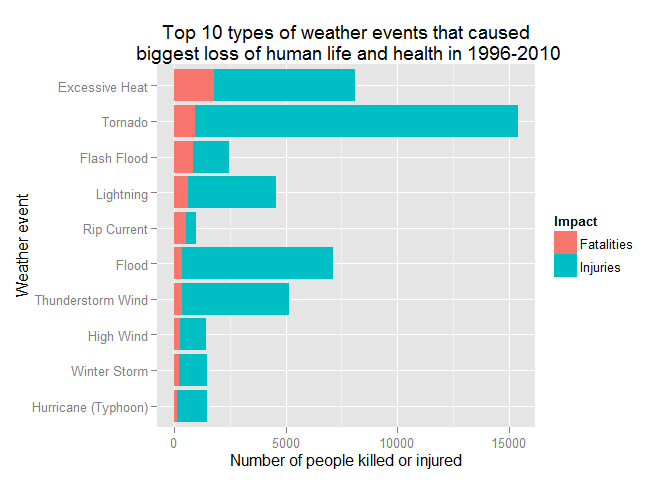
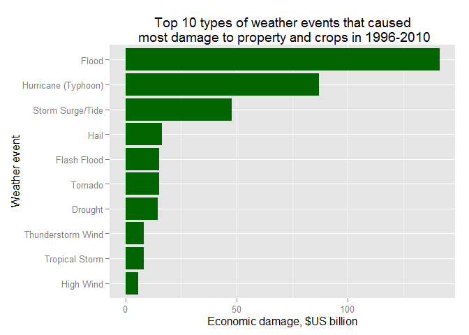

# Tornadoes hit people, floods hurt economics
Alex Gaggin  
Friday, August 14, 2015  

##Synopsis

U.S. National Oceanic and Atmospheric Administration (NOAA)
tracks and classifies significant weather events in the United States in their
storm database,
assessing, in particular, human and dollar damages. The data
in the dataset was available for years 1950-2011, but for consistency reasons
a shorter time period was analyzed - 1996-2010. The conclusion appears valid for
longer period as well: tornadoes were the threat to human life and health even
before unusually deadly outbreak of 2011. Excessive heat is the next overall
hazardous event, and the biggest killer.
From economic damages point of view, tornadoes were not as bad
as floods and hurricanes.

## Data Processing


```r
# Preload libraries
library(digest)
library(dplyr)
library(lubridate)
library(ggplot2)
library(tidyr)
```

The data, originally prepared for download by authors of Reproducible Research
course on the Coursera, was downloaded and loaded to an R data frame.


```r
# setwd(file.path(normalizePath("~"),"Coursera-R","RepData_PeerAssessment2"))
# Knitr works in the Rmd file directory, so this isn't needed for it, but
# it can be useful to re-initialize session in console for dev/test/debug

# Download the file - ignore "%2F" imperfection when making a local file name
remote<-"https://d396qusza40orc.cloudfront.net/repdata%2Fdata%2FStormData.csv.bz2"
localzip<-basename(remote)
if(!file.exists(localzip)) download.file(remote,localzip)
# No need to unzip - read.csv() does it automatically

# For chunk's console usage - no need to reload data if it's loaded and intact
if(!exists("loaded") || digest(loaded) != "b223723dffbf2ec857526bcc32d2a31d")
   loaded <- read.csv(localzip)
# Keep original data frame for console work caching and make a mutable copy
s<-loaded
str(s)
```

```
## 'data.frame':	902297 obs. of  37 variables:
##  $ STATE__   : num  1 1 1 1 1 1 1 1 1 1 ...
##  $ BGN_DATE  : Factor w/ 16335 levels "1/1/1966 0:00:00",..: 6523 6523 4242 11116 2224 2224 2260 383 3980 3980 ...
##  $ BGN_TIME  : Factor w/ 3608 levels "00:00:00 AM",..: 272 287 2705 1683 2584 3186 242 1683 3186 3186 ...
##  $ TIME_ZONE : Factor w/ 22 levels "ADT","AKS","AST",..: 7 7 7 7 7 7 7 7 7 7 ...
##  $ COUNTY    : num  97 3 57 89 43 77 9 123 125 57 ...
##  $ COUNTYNAME: Factor w/ 29601 levels "","5NM E OF MACKINAC BRIDGE TO PRESQUE ISLE LT MI",..: 13513 1873 4598 10592 4372 10094 1973 23873 24418 4598 ...
##  $ STATE     : Factor w/ 72 levels "AK","AL","AM",..: 2 2 2 2 2 2 2 2 2 2 ...
##  $ EVTYPE    : Factor w/ 985 levels "   HIGH SURF ADVISORY",..: 834 834 834 834 834 834 834 834 834 834 ...
##  $ BGN_RANGE : num  0 0 0 0 0 0 0 0 0 0 ...
##  $ BGN_AZI   : Factor w/ 35 levels "","  N"," NW",..: 1 1 1 1 1 1 1 1 1 1 ...
##  $ BGN_LOCATI: Factor w/ 54429 levels "","- 1 N Albion",..: 1 1 1 1 1 1 1 1 1 1 ...
##  $ END_DATE  : Factor w/ 6663 levels "","1/1/1993 0:00:00",..: 1 1 1 1 1 1 1 1 1 1 ...
##  $ END_TIME  : Factor w/ 3647 levels ""," 0900CST",..: 1 1 1 1 1 1 1 1 1 1 ...
##  $ COUNTY_END: num  0 0 0 0 0 0 0 0 0 0 ...
##  $ COUNTYENDN: logi  NA NA NA NA NA NA ...
##  $ END_RANGE : num  0 0 0 0 0 0 0 0 0 0 ...
##  $ END_AZI   : Factor w/ 24 levels "","E","ENE","ESE",..: 1 1 1 1 1 1 1 1 1 1 ...
##  $ END_LOCATI: Factor w/ 34506 levels "","- .5 NNW",..: 1 1 1 1 1 1 1 1 1 1 ...
##  $ LENGTH    : num  14 2 0.1 0 0 1.5 1.5 0 3.3 2.3 ...
##  $ WIDTH     : num  100 150 123 100 150 177 33 33 100 100 ...
##  $ F         : int  3 2 2 2 2 2 2 1 3 3 ...
##  $ MAG       : num  0 0 0 0 0 0 0 0 0 0 ...
##  $ FATALITIES: num  0 0 0 0 0 0 0 0 1 0 ...
##  $ INJURIES  : num  15 0 2 2 2 6 1 0 14 0 ...
##  $ PROPDMG   : num  25 2.5 25 2.5 2.5 2.5 2.5 2.5 25 25 ...
##  $ PROPDMGEXP: Factor w/ 19 levels "","-","?","+",..: 17 17 17 17 17 17 17 17 17 17 ...
##  $ CROPDMG   : num  0 0 0 0 0 0 0 0 0 0 ...
##  $ CROPDMGEXP: Factor w/ 9 levels "","?","0","2",..: 1 1 1 1 1 1 1 1 1 1 ...
##  $ WFO       : Factor w/ 542 levels ""," CI","$AC",..: 1 1 1 1 1 1 1 1 1 1 ...
##  $ STATEOFFIC: Factor w/ 250 levels "","ALABAMA, Central",..: 1 1 1 1 1 1 1 1 1 1 ...
##  $ ZONENAMES : Factor w/ 25112 levels "","                                                                                                                               "| __truncated__,..: 1 1 1 1 1 1 1 1 1 1 ...
##  $ LATITUDE  : num  3040 3042 3340 3458 3412 ...
##  $ LONGITUDE : num  8812 8755 8742 8626 8642 ...
##  $ LATITUDE_E: num  3051 0 0 0 0 ...
##  $ LONGITUDE_: num  8806 0 0 0 0 ...
##  $ REMARKS   : Factor w/ 436781 levels "","-2 at Deer Park\n",..: 1 1 1 1 1 1 1 1 1 1 ...
##  $ REFNUM    : num  1 2 3 4 5 6 7 8 9 10 ...
```

Beginning dates of the events were converted to the time
class and year part was extracted to a separate variable.


```r
# Convert beginning dates to date format
s$BGN_DATE<-mdy_hms(s$BGN_DATE)
s$Year<-format(s$BGN_DATE,"%Y")
```

The NOAA Storm Events Database
[webpage](https://www.ncdc.noaa.gov/stormevents/details.jsp) explained
(see [saved screenshot](https://github.com/gagin/RepData_PeerAssessment2/blob/master/screenshotNOAA20150822.jpg)
that
before 1955 the only event type registered was tornado, and then until 1996
three types of events were recorded - tornado, thunderstorm wind and hail.
Thus the comparison for event types should start in 1996, so the dataset was
filtered to include only these events.


```r
s<-s[s$BGN_DATE>ymd("1996-01-01"),]
```

To limit amount of cleaning afterwards, the dataset was reduced to include only
events that caused fatalities or injuries, or caused property or crops damage.


```r
s<-s[s$FATALITIES != 0 | s$INJURIES != 0 | s$PROPDMG != 0 | s$CROPDMG != 0,]
```

The dataset in review lacks a code book, so investigation was needed to clarify
meaning of some fields, in particular - PROPDMGEXP and CROPDMGEXP fields. They
values corresponded to description in section 2.7 of [NOAA's
documentation}(https://d396qusza40orc.cloudfront.net/repdata%2Fpeer2_doc%2Fpd01016005curr.pdf),
"Alphabetical characters used to signify magnitude
include "K" for thousands, "M" for millions, and "B" for billions".


```r
# Consider only values where damage is nonzero and matters
# Use factor() to drop levels from before subsetting
# First non-zero property
prop<-s[s$PROPDMG != 0,]
prop$PROPDMGEXP<-factor(prop$PROPDMGEXP)
table(prop$PROPDMGEXP)
```

```
## 
##      B      K      M 
##     32 181869   7363
```

```r
# Then non-zero crop
crop<-s[s$CROPDMG != 0,]
crop$CROPDMGEXP<-factor(crop$CROPDMGEXP)
table(crop$CROPDMGEXP)
```

```
## 
##     B     K     M 
##     2 16994  1695
```

It was checked by comparing an example from current dataset to to the current
CSV files on NOAA website that these are indeed the same markers.


```r
# Pick an example event from 2010 and look at it, minus the narrative
# for brevity
somedmg<-tail(prop[prop$PROPDMG>0 &
                             prop$LATITUDE != 0 &
                             prop$BGN_DATE<ymd("2011-01-01"),],1)
somedmg %>% select(-REMARKS)
```

```
##        STATE__   BGN_DATE    BGN_TIME TIME_ZONE COUNTY COUNTYNAME STATE
## 838643      40 2010-12-31 06:01:00 AM       CST      1      ADAIR    OK
##                   EVTYPE BGN_RANGE BGN_AZI BGN_LOCATI           END_DATE
## 838643 THUNDERSTORM WIND         2      NW      BARON 12/31/2010 0:00:00
##           END_TIME COUNTY_END COUNTYENDN END_RANGE END_AZI END_LOCATI
## 838643 06:01:00 AM          0         NA         0                   
##        LENGTH WIDTH  F MAG FATALITIES INJURIES PROPDMG PROPDMGEXP CROPDMG
## 838643      0     0 NA  52          0        0       5          K       0
##        CROPDMGEXP WFO        STATEOFFIC
## 838643          K TSA OKLAHOMA, Eastern
##                                                                                                                                                                                                       ZONENAMES
## 838643                                                                                                                                                                                                         
##        LATITUDE LONGITUDE LATITUDE_E LONGITUDE_ REFNUM Year
## 838643     3556      9439          0          0 838633 2010
```

```r
# Get unprocessed file with event details for 2010, read it, look at it
url<-"http://www1.ncdc.noaa.gov/pub/data/swdi/stormevents/csvfiles/StormEvents_details-ftp_v1.0_d2010_c20140824.csv.gz"
d2010<-basename(url)
if (!file.exists(d2010)) download.file(url,d2010)
bit2010<-read.csv(d2010)
names(bit2010)
```

```
##  [1] "BEGIN_YEARMONTH"    "BEGIN_DAY"          "BEGIN_TIME"        
##  [4] "END_YEARMONTH"      "END_DAY"            "END_TIME"          
##  [7] "EPISODE_ID"         "EVENT_ID"           "STATE"             
## [10] "STATE_FIPS"         "YEAR"               "MONTH_NAME"        
## [13] "EVENT_TYPE"         "CZ_TYPE"            "CZ_FIPS"           
## [16] "CZ_NAME"            "WFO"                "BEGIN_DATE_TIME"   
## [19] "CZ_TIMEZONE"        "END_DATE_TIME"      "INJURIES_DIRECT"   
## [22] "INJURIES_INDIRECT"  "DEATHS_DIRECT"      "DEATHS_INDIRECT"   
## [25] "DAMAGE_PROPERTY"    "DAMAGE_CROPS"       "SOURCE"            
## [28] "MAGNITUDE"          "MAGNITUDE_TYPE"     "FLOOD_CAUSE"       
## [31] "CATEGORY"           "TOR_F_SCALE"        "TOR_LENGTH"        
## [34] "TOR_WIDTH"          "TOR_OTHER_WFO"      "TOR_OTHER_CZ_STATE"
## [37] "TOR_OTHER_CZ_FIPS"  "TOR_OTHER_CZ_NAME"  "BEGIN_RANGE"       
## [40] "BEGIN_AZIMUTH"      "BEGIN_LOCATION"     "END_RANGE"         
## [43] "END_AZIMUTH"        "END_LOCATION"       "BEGIN_LAT"         
## [46] "BEGIN_LON"          "END_LAT"            "END_LON"           
## [49] "EPISODE_NARRATIVE"  "EVENT_NARRATIVE"    "DATA_SOURCE"
```

```r
# Match by start location
sum(bit2010$BEGIN_LOCATION %in% somedmg$BGN_LOCATI)
```

```
## [1] 1
```

```r
# There's only one event, check it out
origdmg<-bit2010[bit2010$BEGIN_LOCATION %in% somedmg$BGN_LOCATI,]

origdmg %>% select(-EPISODE_NARRATIVE)
```

```
##       BEGIN_YEARMONTH BEGIN_DAY BEGIN_TIME END_YEARMONTH END_DAY END_TIME
## 36803          201012        31        601        201012      31      601
##       EPISODE_ID EVENT_ID    STATE STATE_FIPS YEAR MONTH_NAME
## 36803      46132   269055 OKLAHOMA         40 2010   December
##              EVENT_TYPE CZ_TYPE CZ_FIPS CZ_NAME WFO    BEGIN_DATE_TIME
## 36803 Thunderstorm Wind       C       1   ADAIR TSA 31-DEC-10 06:01:00
##       CZ_TIMEZONE      END_DATE_TIME INJURIES_DIRECT INJURIES_INDIRECT
## 36803       CST-6 31-DEC-10 06:01:00               0                 0
##       DEATHS_DIRECT DEATHS_INDIRECT DAMAGE_PROPERTY DAMAGE_CROPS
## 36803             0               0           5.00K        0.00K
##                  SOURCE MAGNITUDE MAGNITUDE_TYPE FLOOD_CAUSE CATEGORY
## 36803 Emergency Manager        52             EG                   NA
##       TOR_F_SCALE TOR_LENGTH TOR_WIDTH TOR_OTHER_WFO TOR_OTHER_CZ_STATE
## 36803                     NA        NA                                 
##       TOR_OTHER_CZ_FIPS TOR_OTHER_CZ_NAME BEGIN_RANGE BEGIN_AZIMUTH
## 36803                NA                             2            NW
##       BEGIN_LOCATION END_RANGE END_AZIMUTH END_LOCATION BEGIN_LAT
## 36803          BARON        NA                              35.94
##       BEGIN_LON END_LAT END_LON
## 36803    -94.65      NA      NA
##                                                                             EVENT_NARRATIVE
## 36803 Emergency management reported damage to a mobile home from strong thunderstorm winds.
##       DATA_SOURCE
## 36803         CSV
```

```r
# Seems to be the same event with minor GPS variation, AND "k" was indeed
# in original damage field
```

EXP markers were used to have damage variables brought to the same scale
and added to a new variable.


```r
unexp<-function(d,exp){
        if (d == 0)
                r<-0
        else if (exp %in% c("k","K"))
                r<-as.numeric(d)*1000
        else if (exp %in% c("m","M"))
                r<-as.numeric(d)*1000000
        else if (exp %in% c("b","B"))
                r<-as.numeric(d)*1000000000
        else print(
                paste0("d is ",d,", exp is ", exp,", and something is wrong"))
        r}

s$cost<-mapply(unexp,s$PROPDMG,s$PROPDMGEXP)+
        mapply(unexp,s$CROPDMG,s$CROPDMGEXP)
```

New variable was added to count all affected people - killed or injured.


```r
s$Affected<-s$FATALITIES+s$INJURIES
# Rename for charting
s<-rename(s,Fatalities=FATALITIES)
s<-rename(s,Injuries=INJURIES)
```

Event types were checked and found to contain variations of the same
event type name. Names were unified to have first letters of words in uppercase,
and "TSTM" was expanded to "Thunderstorm". Notices in parenthesis were dropped,
and if there were several types separated with slash, only first one was kept.


```r
# Again, make sure levels are for current subset
s$EVTYPE<-factor(s$EVTYPE)
evtype.count<-table(s$EVTYPE)
str(evtype.count)
```

```
##  'table' int [1:222(1d)] 1 1 2 1 3 8 2 264 1 1 ...
##  - attr(*, "dimnames")=List of 1
##   ..$ : chr [1:222] "   HIGH SURF ADVISORY" " FLASH FLOOD" " TSTM WIND" " TSTM WIND (G45)" ...
```

```r
# Keep it in separate varible to be safe
# Take only part before " ("
s$type<-sapply(as.character(s$EVTYPE),
               function(x)
                       unlist(strsplit(x," (",fixed=TRUE))[1])

# Check dropped ones
unique(s$EVTYPE[!s$EVTYPE %in% s$type])
```

```
## [1] Ice jam flood (minor    TSTM WIND (G45)         TSTM WIND (41)         
## [4] TSTM WIND (G40)          TSTM WIND (G45)        TSTM WIND  (G45)       
## [7] HIGH WIND (G40)         TSTM WIND (G35)         THUNDERSTORM WIND (G40)
## 222 Levels:    HIGH SURF ADVISORY  FLASH FLOOD ... WINTRY MIX
```

```r
# Repeat for slash
s$type<-sapply(as.character(s$type),
               function(x)
                       unlist(strsplit(x,"/",fixed=TRUE))[1])

#All good. Convert first letters to uppercase.

# Use modified function from toupper() help page
.simpleCapDecap <- function(x) {
    s <- strsplit(x, " ")[[1]]
    paste(toupper(substring(s, 1, 1)), tolower(substring(s, 2)),
          sep = "", collapse = " ")
}

s$type<-sapply(s$type,.simpleCapDecap)

# retype() replaces fixed strings, aggr() replaces if pattern is found

retype<-function(df,from,to)
        mutate(df,type=ifelse(type==from,to,type))

aggr<-function(df,pattern,to)
        mutate(df,type=ifelse(grepl(pattern,type,ignore.case=TRUE),to,type))

s<-aggr(s,"tstm w","Thunderstorm Wind")

type.count<-table(s$type)
str(type.count)
```

```
##  'table' int [1:153(1d)] 1 1 3 8 2 264 1 1 228 1 ...
##  - attr(*, "dimnames")=List of 1
##   ..$ : chr [1:153] "   High Surf Advisory" " Flash Flood" "Agricultural Freeze" "Astronomical High Tide" ...
```

[NWS Directive
10-1605](http://www.ncdc.noaa.gov/stormevents/pd01016005curr.pdf) recognizes
48 event types. The list was copied to a reference vector. Types with
alternative names were aggregated, and non-reference
entries listed.


```r
events<-"Astronomical Low Tide Z
Avalanche Z
Blizzard Z
Coastal Flood Z
Cold/Wind Chill Z
Debris Flow C
Dense Fog Z
Dense Smoke Z
Drought Z
Dust Devil C
Dust Storm Z
Excessive Heat Z
Extreme Cold/Wind Chill Z
Flash Flood C
Flood C
Frost/Freeze Z
Funnel Cloud C
Freezing Fog Z
Hail C
Heat Z
Heavy Rain C
Heavy Snow Z
High Surf Z
High Wind Z
Hurricane (Typhoon) Z
Ice Storm Z
Lake-Effect Snow Z
Lakeshore Flood Z
Lightning C
Marine Hail M
Marine High Wind M
Marine Strong Wind M
Marine Thunderstorm Wind M
Rip Current Z
Seiche Z
Sleet Z
Storm Surge/Tide Z
Strong Wind Z
Thunderstorm Wind C
Tornado C
Tropical Depression Z
Tropical Storm Z
Tsunami Z
Volcanic Ash Z
Waterspout M
Wildfire Z
Winter Storm Z
Winter Weather"
# Last Z removed to simplify next action
events<-unlist(strsplit(events," [CZM]\n", per=TRUE))

s<-retype(s,"Cold","Cold/Wind Chill")
s<-retype(s,"Wind Chill","Cold/Wind Chill")
s<-retype(s,"Extreme Cold","Extreme Cold/Wind Chill")
s<-retype(s,"Frost","Frost/Freeze")
s<-retype(s,"Freeze","Frost/Freeze")
s<-retype(s,"Hurricane","Hurricane (Typhoon)")
s<-retype(s,"Typhoon","Hurricane (Typhoon)")
s<-retype(s,"Storm Surge","Storm Surge/Tide")
s<-retype(s,"Tide","Storm Surge/Tide")

# How may of EVTYPE are official? Make uppercase before comparison.
type.count<-table(s$type)
irregulars<-type.count[!names(type.count) %in% events]
str(irregulars)
```

```
##  int [1:106(1d)] 1 1 3 8 1 1 1 1 1 1 ...
##  - attr(*, "dimnames")=List of 1
##   ..$ : chr [1:106] "   High Surf Advisory" " Flash Flood" "Agricultural Freeze" "Astronomical High Tide" ...
```
                
Further replacements were made to make event names adhere to reference. Two
event types were added - Other and Urban, as there was no obvious replacement
in the reference list.


```r
# Next commented command is for console to automate generating replacement calls
# for(i in names(irregulars))cat(paste0('s<-retype(s,"',i,'","")\n'))
# and clean names to replace
# cat(events,sep="\n")
# Copy first printout here, use second one for copy-paste
s<-retype(s,"   High Surf Advisory","High Surf")
s<-retype(s," Flash Flood","Flash Flood")
s<-retype(s,"Agricultural Freeze","Frost/Freeze")
s<-retype(s,"Astronomical High Tide","Storm Surge/Tide")
s<-retype(s,"Beach Erosion","High Surf")
s<-retype(s,"Black Ice","Frost/Freeze")
s<-retype(s,"Blowing Dust","Dust Storm")
s<-retype(s,"Blowing Snow","Winter Storm")
s<-retype(s,"Brush Fire","Wildfire")
s<-retype(s,"Coastal  Flooding","Coastal Flood")
s<-retype(s,"Coastal Erosion","High Surf")
s<-retype(s,"Coastal Flooding","Coastal Flood")
s<-retype(s,"Coastal Storm","Tropical Storm")
s<-retype(s,"Coastalstorm","Tropical Storm")
s<-retype(s,"Cold And Snow","Cold/Wind Chill")
s<-retype(s,"Cold Temperature","Cold/Wind Chill")
s<-retype(s,"Cold Weather","Cold/Wind Chill")
s<-retype(s,"Dam Break","Lakeshore Flood")
s<-retype(s,"Damaging Freeze","Frost/Freeze")
s<-retype(s,"Downburst","Thunderstorm Wind")
s<-retype(s,"Drowning","Flood")
s<-retype(s,"Dry Microburst","Thunderstorm Wind")
s<-retype(s,"Early Frost","Frost/Freeze")
s<-retype(s,"Erosion","High Surf")
s<-retype(s,"Excessive Snow","Winter Weather")
s<-retype(s,"Extended Cold","Frost/Freeze")
s<-retype(s,"Extreme Windchill","Extreme Cold/Wind Chill")
s<-retype(s,"Falling Snow","Winter Weather")
s<-retype(s,"Fog","Dense Fog")
s<-retype(s,"Freezing Drizzle","Sleet")
s<-retype(s,"Freezing Rain","Sleet")
s<-retype(s,"Freezing Spray","Sleet")
s<-retype(s,"Glaze","Winter Weather")
s<-retype(s,"Gradient Wind","Strong Wind")
s<-retype(s,"Gusty Wind","Strong Wind")
s<-retype(s,"Gusty Winds","Strong Wind")
s<-retype(s,"Hard Freeze","Frost/Freeze")
s<-retype(s,"Hazardous Surf","High Surf")
s<-retype(s,"Heat Wave","Excessive Heat")
s<-retype(s,"Heavy Seas","Storm Surge/Tide")
s<-retype(s,"Heavy Snow Shower","Heavy Snow")
s<-retype(s,"Heavy Surf","High Surf")
s<-retype(s,"Heavy Surf And Wind","High Surf")
s<-retype(s,"High Seas","High Surf")
s<-retype(s,"High Swells","High Surf")
s<-retype(s,"High Water","High Surf")
s<-retype(s,"High Winds","Strong Wind")
s<-retype(s,"Hurricane Edouard","Hurricane (Typhoon)")
s<-retype(s,"Hyperthermia","Cold/Wind Chill")
s<-retype(s,"Hypothermia","Cold/Wind Chill")
s<-retype(s,"Ice Jam Flood","Flood")
s<-retype(s,"Ice On Road","Frost/Freeze")
s<-retype(s,"Ice Roads","Frost/Freeze")
s<-retype(s,"Icy Roads","Frost/Freeze")
s<-retype(s,"Lake-effect Snow","Heavy Snow")
s<-retype(s,"Lake Effect Snow","Heavy Snow")
s<-retype(s,"Landslide","Debris Flow")
s<-retype(s,"Landslides","Debris Flow")
s<-retype(s,"Landslump","Debris Flow")
s<-retype(s,"Landspout","Dust Devil")
s<-retype(s,"Late Season Snow","Winter Weather")
s<-retype(s,"Light Freezing Rain","Winter Weather")
s<-retype(s,"Light Snow","Winter Weather")
s<-retype(s,"Light Snowfall","Winter Weather")
s<-retype(s,"Marine Accident","Marine Strong Wind")
s<-retype(s,"Microburst","Dust Devil")
s<-retype(s,"Mixed Precip","Heavy Rain")
s<-retype(s,"Mixed Precipitation","Heavy Rain")
s<-retype(s,"Mud Slide","Debris Flow")
s<-retype(s,"Mudslide","Debris Flow")
s<-retype(s,"Mudslides","Debris Flow")
s<-retype(s,"Non-severe Wind Damage","Strong Wind")
#s<-retype(s,"Other","")
s<-retype(s,"Rain","Heavy Rain")
s<-retype(s,"Record Heat","Excessive Heat")
s<-retype(s,"Rip Currents","Rip Current")
s<-retype(s,"River Flood","Flood")
s<-retype(s,"River Flooding","Flood")
s<-retype(s,"Rock Slide","Debris Flow")
s<-retype(s,"Rogue Wave","Storm Surge/Tide")
s<-retype(s,"Rough Seas","Marine High Wind")
s<-retype(s,"Rough Surf","High Surf")
s<-retype(s,"Small Hail","Hail")
s<-retype(s,"Snow","Heavy Snow")
s<-retype(s,"Snow And Ice","Heavy Snow")
s<-retype(s,"Snow Squall","Heavy Snow")
s<-retype(s,"Snow Squalls","Heavy Snow")
s<-retype(s,"Strong Winds","High Wind")
s<-retype(s,"Thunderstorm","Thunderstorm Wind")
s<-retype(s,"Tidal Flooding","Coastal Flood")
s<-retype(s,"Torrential Rainfall","Heavy Rain")
s<-retype(s,"Unseasonable Cold","Cold/Wind Chill")
s<-retype(s,"Unseasonably Cold","Cold/Wind Chill")
s<-retype(s,"Unseasonably Warm","Heat")
s<-retype(s,"Unseasonal Rain","Heavy Rain")
#s<-retype(s,"Urban","")
s<-retype(s,"Warm Weather","Heat")
s<-retype(s,"Wet Microburst","Thunderstorm Wind")
s<-retype(s,"Whirlwind","Thunderstorm Wind")
s<-retype(s,"Wild","Other")
s<-retype(s,"Wind","High Wind")
s<-retype(s,"Wind And Wave","Tropical Storm")
s<-retype(s,"Wind Damage","High Wind")
s<-retype(s,"Winds","High Wind")
s<-retype(s,"Winter Weather Mix","Winter Weather")
s<-retype(s,"Wintry Mix","Winter Weather")
s$type<-as.factor(s$type)
```

Top 10 event types that caused most life loss and injuries were selected.


```r
deadly10<-tapply(s$Affected,s$type,sum) %>%
        sort(decr=TRUE) %>%
        head(10) %>%
        data.frame
names(deadly10)<-'Affected'
deadly10$Event<-rownames(deadly10)
# Order it to prevent gplot from re-sorting bar alphabetically
deadly10$Event<-factor(deadly10$Event, levels=rev(deadly10$Event))
print(deadly10, row.names=FALSE)
```

```
##  Affected               Event
##     22178             Tornado
##      8260      Excessive Heat
##      7176               Flood
##      5555   Thunderstorm Wind
##      4790           Lightning
##      2561         Flash Flood
##      1485        Winter Storm
##      1478                Heat
##      1453 Hurricane (Typhoon)
##      1449           High Wind
```


Top 10 event types that caused most economic damage were selected.


```r
costly10<-tapply(s$cost,s$type,sum) %>%
        sort(decr=TRUE) %>%
        head(10) %>%
        data.frame
names(costly10)<-'EconomicDamage'
costly10$Event<-rownames(costly10)
costly10$Event<-factor(costly10$Event, levels=rev(costly10$Event))
print(costly10, row.names=FALSE)
```

```
##  EconomicDamage               Event
##    149075954950               Flood
##     87068996810 Hurricane (Typhoon)
##     47845004000    Storm Surge/Tide
##     24900330720             Tornado
##     17092035870                Hail
##     16557160610         Flash Flood
##     14413667000             Drought
##      8937741080   Thunderstorm Wind
##      8321236550      Tropical Storm
##      5886273950           High Wind
```


Numbers of people affected were reviewed annually.


```r
Tornado<-s[s$type=="Tornado",]
Annual.tornado.health.damage<-with(Tornado, tapply(Affected,Year,sum))
# Compendate for the missing month in 2011
Annual.tornado.health.damage["2011"]<-
        round(Annual.tornado.health.damage["2011"]*12/11)
Annual.tornado.health.damage
```

```
## 1996 1997 1998 1999 2000 2001 2002 2003 2004 2005 2006 2007 2008 2009 2010 
##  731 1101 2004 1936  923  783 1023 1141  431  575 1059  740 1819  418  744 
## 2011 
## 7364
```

An outlier was found in 2011 and an google search showed there was indeed
a deadliest tornado outbreak in April 2011, so damages were reviewed
in 1996 - 2010 to set the outbreak aside.


```r
framed<-s[s$BGN_DATE<ymd("2011-01-01"),]

deadly10<-tapply(framed$Affected,framed$type,sum) %>%
        sort(decr=TRUE) %>%
        head(10) %>%
        data.frame
names(deadly10)<-'Affected'
deadly10$Event<-rownames(deadly10)
print(deadly10, row.names=FALSE)
```

```
##  Affected               Event
##     15428             Tornado
##      8086      Excessive Heat
##      7108               Flood
##      5128   Thunderstorm Wind
##      4570           Lightning
##      2463         Flash Flood
##      1484        Winter Storm
##      1453 Hurricane (Typhoon)
##      1434           High Wind
##       989         Rip Current
```

```r
# Group to display fatalities and injuries separately
hazard.grouped <- framed %>%
        gather(Impact, hazard.value, Fatalities, Injuries) %>%
        group_by(type,Impact) %>%
        summarize(Impacted=sum(hazard.value))%>%
        filter(type %in% deadly10$Event)

sorted.by.fatalities<-hazard.grouped[hazard.grouped$Impact=='Fatalities',] %>%
        ungroup() %>%
        arrange(desc(Impacted))

hazard.grouped$type<-factor(hazard.grouped$type,
                            levels=rev(sorted.by.fatalities$type))

# Economic damage
costly10<-tapply(framed$cost,framed$type,sum) %>%
        sort(decr=TRUE) %>%
        head(10) %>%
        data.frame
names(costly10)<-'EconomicDamage'
costly10$Event<-rownames(costly10)
costly10$Event<-factor(costly10$Event, levels=rev(costly10$Event))
print(costly10, row.names=FALSE)
```

```
##  EconomicDamage               Event
##    141203405500               Flood
##     87047996810 Hurricane (Typhoon)
##     47804309000    Storm Surge/Tide
##     16558372320                Hail
##     15084668910         Flash Flood
##     15049369020             Tornado
##     14382279000             Drought
##      8416017670   Thunderstorm Wind
##      8157993350      Tropical Storm
##      5800029950           High Wind
```

It was decided to operate 1996-2010 year range to draw general conclusions,
as dropping 2011 didn't change the event type comparison picture - Tornado
was still the biggest hazard to people, even before 2011 outbreak.

It was also decided to keep top 10 events, affecting population health in sum
of fatalities and injuries, but sort them on the following charts by fatalities.

## Results

Tornadoes, supposedly as a result of their rapid nature, are the biggest
cause of human life loss and injuries in total. They are far ahead even without
significant outbreak in 2011. Although the deadliest
force is actually excessive heat. 


```r
# Faceted chart doesn't look better - if scale is common, and it makes
# sense to have it common, then part with fatalities has lot of empty space
redplot<-ggplot(hazard.grouped,
                aes(x=type,y=Impacted,fill=Impact))+
        geom_bar(stat="identity")+
        coord_flip()+
        ggtitle("Top 10 types of weather events that caused\n biggest loss of human life and health in 1996-2010")+
        ylab("Number of people killed or injured")+
        xlab("Weather event")
print(redplot)
```

 


Damage to property and agriculture is more significant from floods and
hurricanes.


```r
# Scale damages to thousands to billions
greenplot<-ggplot(data=costly10,
          aes(x=Event,y=EconomicDamage/1000000000)
          )+
        geom_bar(stat='identity',fill='darkgreen')+
        coord_flip()+
        ggtitle("Top 10 types of weather events that caused\n most damage to property and crops in 1996-2010")+
        ylab("Economic damage, $US billion")+
        xlab("Weather event")
print(greenplot)
```

 

