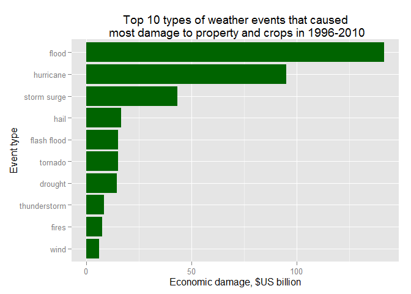

# Tornado hit people, floods hurt economics
Alex Gaggin  
Friday, August 14, 2015  

##Synopsis

U.S. National Oceanic and Atmospheric Administration (NOAA)
tracks and classifies significant weather events in the United States in their
storm database,
assessing, in particular, human and dollar damages. The data
in the dataset was available for years 1950-2011, but for consistency reasons
a shorter time period was analyzed - 1996-2010. The conclusion appears valid for
longer period as well: tornadoes were the threat to human life and health even
before unusually deadly outbreak of 2011.
From economic damages point of view, tornadoes were not as bad
as floods and hurricanes.

## Data Processing


```r
# Preload libraries
library(digest)
library(dplyr)
library(lubridate)
library(ggplot2)
```

The data was prepared for download by authors of Reproducible Research course on
the Coursera. It's downloaded and loaded to an R data frame.


```r
# setwd(file.path(normalizePath("~"),"Coursera-R","RepData_PeerAssessment2"))
# Knitr works in the Rmd file directory, so this isn't needed for it, but
# it can be useful to re-initialize session in console for dev/test/debug

# Download the file - ignore "%2F" imperfection when making a local file name
remote<-"https://d396qusza40orc.cloudfront.net/repdata%2Fdata%2FStormData.csv.bz2"
localzip<-basename(remote)
if(!file.exists(localzip)) download.file(remote,localzip)
# No need to unzip - read.csv() does it automatically

# For chunk's console usage - no need to reload data if it's loaded and intact
if(!exists("loaded") || digest(loaded) != "b223723dffbf2ec857526bcc32d2a31d")
   loaded <- read.csv(localzip)
# We keep original data frame for console work caching and make a mutable copy
s<-loaded
```

Beginning dates of the events are converted to the time class and year part
is extracted to a separate variable.


```r
# Convert beginning dates to date format
s$BGN_DATE<-mdy_hms(s$BGN_DATE)
s$Year<-format(s$BGN_DATE,"%Y")
```

First, let's deal with PROPDMGEXP and CROPDMGEXP fields. The dataset provided
for this exercise doesn't include a code book, so to make sure that we
understand the data properly, and, in particular scale of PROPDMG and CROPDMG
field, let's load the original dataset files from NOAA website, where,
according to section 2.7 of their
[documentation}(https://d396qusza40orc.cloudfront.net/repdata%2Fpeer2_doc%2Fpd01016005curr.pdf),
"Alphabetical characters used to signify magnitude
include "K" for thousands, "M" for millions, and "B" for billions".


```r
# Let's pick an example event from 2010 and look at it, minus the narrative
# for brevity
somedmg<-tail(s[s$PROPDMG>0 &
                             s$LATITUDE != 0 &
                             s$BGN_DATE<ymd("2011-01-01"),],1)
somedmg %>% select(-REMARKS)
```

```
##        STATE__   BGN_DATE    BGN_TIME TIME_ZONE COUNTY COUNTYNAME STATE
## 838643      40 2010-12-31 06:01:00 AM       CST      1      ADAIR    OK
##                   EVTYPE BGN_RANGE BGN_AZI BGN_LOCATI           END_DATE
## 838643 THUNDERSTORM WIND         2      NW      BARON 12/31/2010 0:00:00
##           END_TIME COUNTY_END COUNTYENDN END_RANGE END_AZI END_LOCATI
## 838643 06:01:00 AM          0         NA         0                   
##        LENGTH WIDTH  F MAG FATALITIES INJURIES PROPDMG PROPDMGEXP CROPDMG
## 838643      0     0 NA  52          0        0       5          K       0
##        CROPDMGEXP WFO        STATEOFFIC
## 838643          K TSA OKLAHOMA, Eastern
##                                                                                                                                                                                                       ZONENAMES
## 838643                                                                                                                                                                                                         
##        LATITUDE LONGITUDE LATITUDE_E LONGITUDE_ REFNUM Year
## 838643     3556      9439          0          0 838633 2010
```

```r
# Let's get unprocessed file with event details for 2010, read it, look at it
url<-"http://www1.ncdc.noaa.gov/pub/data/swdi/stormevents/csvfiles/StormEvents_details-ftp_v1.0_d2010_c20140824.csv.gz"
d2010<-basename(url)
if (!file.exists(d2010)) download.file(url,d2010)
bit2010<-read.csv(d2010)
names(bit2010)
```

```
##  [1] "BEGIN_YEARMONTH"    "BEGIN_DAY"          "BEGIN_TIME"        
##  [4] "END_YEARMONTH"      "END_DAY"            "END_TIME"          
##  [7] "EPISODE_ID"         "EVENT_ID"           "STATE"             
## [10] "STATE_FIPS"         "YEAR"               "MONTH_NAME"        
## [13] "EVENT_TYPE"         "CZ_TYPE"            "CZ_FIPS"           
## [16] "CZ_NAME"            "WFO"                "BEGIN_DATE_TIME"   
## [19] "CZ_TIMEZONE"        "END_DATE_TIME"      "INJURIES_DIRECT"   
## [22] "INJURIES_INDIRECT"  "DEATHS_DIRECT"      "DEATHS_INDIRECT"   
## [25] "DAMAGE_PROPERTY"    "DAMAGE_CROPS"       "SOURCE"            
## [28] "MAGNITUDE"          "MAGNITUDE_TYPE"     "FLOOD_CAUSE"       
## [31] "CATEGORY"           "TOR_F_SCALE"        "TOR_LENGTH"        
## [34] "TOR_WIDTH"          "TOR_OTHER_WFO"      "TOR_OTHER_CZ_STATE"
## [37] "TOR_OTHER_CZ_FIPS"  "TOR_OTHER_CZ_NAME"  "BEGIN_RANGE"       
## [40] "BEGIN_AZIMUTH"      "BEGIN_LOCATION"     "END_RANGE"         
## [43] "END_AZIMUTH"        "END_LOCATION"       "BEGIN_LAT"         
## [46] "BEGIN_LON"          "END_LAT"            "END_LON"           
## [49] "EPISODE_NARRATIVE"  "EVENT_NARRATIVE"    "DATA_SOURCE"
```

```r
# Try to match by latitude, using %in% to ignore NAs
sum(bit2010$BEGIN_LAT %in% somedmg$LATITUDE)
```

```
## [1] 0
```

```r
# Nothing? Try by location
sum(bit2010$BEGIN_LOCATION %in% somedmg$BGN_LOCATI)
```

```
## [1] 1
```

```r
# There's only one event, let's check it out
origdmg<-bit[bit2010$BEGIN_LOCATION %in% somedmg$BGN_LOCATI,]

origdmg %>% select(-EPISODE_NARRATIVE)
```

```
##       BEGIN_YEARMONTH BEGIN_DAY BEGIN_TIME END_YEARMONTH END_DAY END_TIME
## 36803          201012        31        601        201012      31      601
##       EPISODE_ID EVENT_ID    STATE STATE_FIPS YEAR MONTH_NAME
## 36803      46132   269055 OKLAHOMA         40 2010   December
##              EVENT_TYPE CZ_TYPE CZ_FIPS CZ_NAME WFO    BEGIN_DATE_TIME
## 36803 Thunderstorm Wind       C       1   ADAIR TSA 31-DEC-10 06:01:00
##       CZ_TIMEZONE      END_DATE_TIME INJURIES_DIRECT INJURIES_INDIRECT
## 36803       CST-6 31-DEC-10 06:01:00               0                 0
##       DEATHS_DIRECT DEATHS_INDIRECT DAMAGE_PROPERTY DAMAGE_CROPS
## 36803             0               0           5.00K        0.00K
##                  SOURCE MAGNITUDE MAGNITUDE_TYPE FLOOD_CAUSE CATEGORY
## 36803 Emergency Manager        52             EG                   NA
##       TOR_F_SCALE TOR_LENGTH TOR_WIDTH TOR_OTHER_WFO TOR_OTHER_CZ_STATE
## 36803                     NA        NA                                 
##       TOR_OTHER_CZ_FIPS TOR_OTHER_CZ_NAME BEGIN_RANGE BEGIN_AZIMUTH
## 36803                NA                             2            NW
##       BEGIN_LOCATION END_RANGE END_AZIMUTH END_LOCATION BEGIN_LAT
## 36803          BARON        NA                              35.94
##       BEGIN_LON END_LAT END_LON
## 36803    -94.65      NA      NA
##                                                                             EVENT_NARRATIVE
## 36803 Emergency management reported damage to a mobile home from strong thunderstorm winds.
##       DATA_SOURCE
## 36803         CSV
```

```r
# Seems to be the same event, not sure why coordinates are a bit different -
# was there an update to the database since the copy for the task was made
# by the author of the pre-processed dataset?
```

We see that K in PROPDMGEXP corresponds to K signifier of the damage in the
original files. What other markers do we have and how many of them?
*Obviously, we wouldn't reproduce all the following picking at the data, would
it be a real report, but for purposes of this exercise here it is, in extra
details, as prescribed.*

```r
table(s$PROPDMGEXP)
```

```
## 
##             -      ?      +      0      1      2      3      4      5 
## 465934      1      8      5    216     25     13      4      4     28 
##      6      7      8      B      h      H      K      m      M 
##      4      5      1     40      1      6 424665      7  11330
```

```r
table(s$CROPDMGEXP)
```

```
## 
##             ?      0      2      B      k      K      m      M 
## 618413      7     19      1      9     21 281832      1   1994
```

We can check them "m" in PROPDMGEXP field is the same as M.


```r
somedmg.m<-tail(s[s$PROPDMG>0 &
                             s$LATITUDE != 0 &
                             s$BGN_DATE<ymd("2011-01-01") &
                             s$PROPDMGEXP == "m",],1)
somedmg.m %>% select(-REMARKS)
```

```
##        STATE__   BGN_DATE BGN_TIME TIME_ZONE COUNTY       COUNTYNAME STATE
## 211464      28 1994-11-27     2040       CST     49 HINDS AND RANKIN    MS
##         EVTYPE BGN_RANGE BGN_AZI BGN_LOCATI END_DATE END_TIME COUNTY_END
## 211464 TORNADO         0                              2110CST          0
##        COUNTYENDN END_RANGE END_AZI END_LOCATI LENGTH WIDTH F MAG
## 211464         NA         0                        20   200 1   0
##        FATALITIES INJURIES PROPDMG PROPDMGEXP CROPDMG CROPDMGEXP WFO
## 211464          0        0       1          m       0               
##        STATEOFFIC ZONENAMES LATITUDE LONGITUDE LATITUDE_E LONGITUDE_
## 211464                          3224      9014       3226       8956
##        REFNUM Year
## 211464 211384 1994
```

```r
# This one is actually from 1994, and its location is empty
url<-"http://www1.ncdc.noaa.gov/pub/data/swdi/stormevents/csvfiles/StormEvents_details-ftp_v1.0_d1994_c20140824.csv.gz"
d1994<-basename(url)
if (!file.exists(d1994)) download.file(url,d1994)
bit1994<-read.csv(d1994)

# Is there an event with 1M property damage?
table(bit1994$DAMAGE_PROPERTY)
```

```
## 
## .01M .05K  .1K  .1M  .2K  .2M  .3K  .4M  .50  .5K  .5M  .7K  .9K    0   00 
##    1  197    1    2    7    4    2    1    1 1278    1    2    1 8820    1 
##   0K 1.2K 1.3M 1.5K   10 100K  10K 110K 150K  15K   1K   1M 2.5K   20 200K 
##   21    1    1    1    2    4   18    1    3    5   27    3    1    2    2 
##  20K 250K  25K   2h   2K   2M    3 3.3K 3.5K   30  30K   3K   40 400K  40K 
##   11    2    9    1   25    1    1    1    1    1    9   17    1    1    4 
##   4K  500 500K  50K  50M  550  55K   5K   5M   6K  75K   7K  800   8K   9K 
##    3    2  560 1564   14    1    1 2862  115    2    3    1    1    1    1
```

```r
# We have three, let's look at them
bit1994[bit1994$DAMAGE_PROPERTY=="1M",] %>% select(-EVENT_NARRATIVE)
```

```
##      BEGIN_YEARMONTH BEGIN_DAY BEGIN_TIME END_YEARMONTH END_DAY END_TIME
## 1637          199411        27       2040        199411      27     2110
## 3745          199409        21       1435        199409      21     1435
## 4152          199411        27       1730        199411      27     1755
##      EPISODE_ID EVENT_ID       STATE STATE_FIPS YEAR MONTH_NAME EVENT_TYPE
## 1637         NA 10331001 MISSISSIPPI         28 1994  November     Tornado
## 3745         NA 10330697   MINNESOTA         27 1994  September       Hail
## 4152         NA 10330370 MISSISSIPPI         28 1994  November     Tornado
##      CZ_TYPE CZ_FIPS            CZ_NAME WFO    BEGIN_DATE_TIME CZ_TIMEZONE
## 1637       C      49   HINDS AND RANKIN  NA 27-NOV-94 20:40:00         CST
## 3745       C     145            STEARNS  NA 21-SEP-94 14:35:00         CST
## 4152       C      99 NESHOBA AND KEMPER  NA 27-NOV-94 17:30:00         CST
##           END_DATE_TIME INJURIES_DIRECT INJURIES_INDIRECT DEATHS_DIRECT
## 1637 27-NOV-94 21:10:00               0                 0             0
## 3745 21-SEP-94 14:35:00               0                 0             0
## 4152 27-NOV-94 17:55:00               0                 0             0
##      DEATHS_INDIRECT DAMAGE_PROPERTY DAMAGE_CROPS SOURCE MAGNITUDE
## 1637               0              1M            0     NA      0.00
## 3745               0              1M            0     NA      0.75
## 4152               0              1M            0     NA      0.00
##      MAGNITUDE_TYPE FLOOD_CAUSE CATEGORY TOR_F_SCALE TOR_LENGTH TOR_WIDTH
## 1637             NA          NA       NA          F1         20       200
## 3745             NA          NA       NA                      0         0
## 4152             NA          NA       NA          F1         16       100
##      TOR_OTHER_WFO TOR_OTHER_CZ_STATE TOR_OTHER_CZ_FIPS TOR_OTHER_CZ_NAME
## 1637            NA                 NA                NA                NA
## 3745            NA                 NA                NA                NA
## 4152            NA                 NA                NA                NA
##      BEGIN_RANGE BEGIN_AZIMUTH BEGIN_LOCATION END_RANGE END_AZIMUTH
## 1637           0                                      0            
## 3745           0                         Esko         0            
## 4152           0                                      0            
##      END_LOCATION BEGIN_LAT BEGIN_LON END_LAT END_LON EPISODE_NARRATIVE
## 1637                   32.4    -90.23   32.43  -89.93                NA
## 3745                     NA        NA      NA      NA                NA
## 4152                   32.6    -89.12   32.77  -88.88                NA
##      DATA_SOURCE
## 1637         CSV
## 3745         CSV
## 4152         CSV
```

```r
# Here's our tornado in Hinds and Rankin on November 27th at 20:40, it matches
```

The "h" wasn't mentioned in the description, but we assume it's hundreds,
because it's denoted like this in the original files as well.


```r
somedmg.H<-tail(s[s$PROPDMG>0 &
                             s$BGN_DATE<ymd("2011-01-01") &
                             s$PROPDMGEXP == "H",],1)
somedmg.H %>% select(-REMARKS)
```

```
##        STATE__   BGN_DATE BGN_TIME TIME_ZONE COUNTY COUNTYNAME STATE
## 248038      56 1995-07-15     1818       MST      5   CAMPBELL    WY
##        EVTYPE BGN_RANGE BGN_AZI BGN_LOCATI END_DATE END_TIME COUNTY_END
## 248038   HAIL         0           Gillette           1824MST          0
##        COUNTYENDN END_RANGE END_AZI END_LOCATI LENGTH WIDTH  F MAG
## 248038         NA         0                         0     0 NA   0
##        FATALITIES INJURIES PROPDMG PROPDMGEXP CROPDMG CROPDMGEXP WFO
## 248038          0        2       5          H       0               
##        STATEOFFIC ZONENAMES LATITUDE LONGITUDE LATITUDE_E LONGITUDE_
## 248038                             0         0          0          0
##        REFNUM Year
## 248038 247989 1995
```

```r
# Let's get 1995 and look if this event destroyed 500 dollars of property
url<-"http://www1.ncdc.noaa.gov/pub/data/swdi/stormevents/csvfiles/StormEvents_details-ftp_v1.0_d1995_c20140916.csv.gz"
d1995<-basename(url)
if (!file.exists(d1995)) download.file(url,d1995)
bit1995<-read.csv(d1995)

# Is there an event with 500 property damage?
table(bit1995$DAMAGE_PROPERTY)
```

```
## 
##  .01M  .02M  .03M  .05K  .05M  .07M  .08M   .10   .15  .15M   .1K   .1M 
##    61    22     8    18    21     1     1     1     1     1   140    42 
##   .25  .25M   .2K   .2M   .3K   .3M  .45M   .4K   .4M   .5K   .5M  .65M 
##     1     2   101    12    38    11     1    13     4   152    14     2 
##   .6K   .6M   .70   .7K   .7M   .8K   .9K     0    00    01    02    03 
##     7     1     1     3     2     5     2 13346     2    23     9     2 
##    05    07    08    0K     1  1.1M  1.2B  1.2K  1.3K  1.4K  1.4M  1.5K 
##     9     2     1    44     4     3     1     4     3     4     1    28 
##  1.5M  1.6M  1.7K  1.8M    10   100  100K   104   105  105K  106K   10K 
##    15     1     1     1     4    19   105     1     1     1     1   554 
##   10M  110K   11K   120  120K   122   125  125K   12K   12M  130K  135K 
##    13     7     3     2     8     1     2    17    29     1     2     2 
##   13K  140K   145  145K   147   14K    15   150  150K   156   15K   15M 
##     1     3     1     1     1     4     1     6    30     1   202     3 
##  160K   16K  170K  175K  180K  185K   18K  195K    1K    1M     2  2.2K 
##     2     2     3     4     2     1    13     1   719    25     5     1 
##  2.4K  2.5K  2.5M  2.7K  2.8M    20   200  200K   203  204K   20K   20M 
##     1    12     6     1     1     6    14    42     1     2   284     8 
##  210K  220M  225K   22K   23K  240K   246   24K   24M   250  250K   25K 
##     2     1     1     7     3     1     1     2     1    13    33   152 
##   25M   266  275K    2H    2K    2M     3  3.2K  3.3K  3.3M  3.4K  3.5K 
##     1     1     1     1   879    14     7     1     2     1     2     5 
##  3.5M    30   300  300K  303K   305   30K   30M  325K   32K  330K   34M 
##     2     1    12    24     1     1   138     1     1     1     1     1 
##    35   350  350K   35K  375K   37K   38K    3H    3K    3M     4  4.1K 
##     1     1     8    19     1     1     1     1   375    11     3     1 
##  4.1M  4.2K  4.3K  4.4K  4.5K  4.6M  4.9M   400  400K   40K   40M   42K 
##     1     2     1     2     3     1     1     5    10    84     1     2 
##   430   450  450K   45K  460K  475K    4K    4M     5  5.4K  5.5K    50 
##     1     2     2    13     1     1   168     3     6     1     3     6 
##   500  500K   50K   50M  518K   55K   56K    5H    5K    5M     6  6.4K 
##    56    83   306     6     1    11     1     4  1136    19     5     1 
##  6.5K  6.6M  6.7K    60   600  600K   60K   60M   62K  630K  650K   65K 
##     1     1     1     1     2     8    27     1     1     1     3     2 
##   670    6K    6M     7  7.5K  7.7K   700  700K   70K   750  750K   75K 
##     1    49     4     1     2     1     6     2    17     9     6    57 
##   75M    7K    7M     8  8.2K  8.3K  8.5K   800  800K   80K   85K   885 
##     2    48     1     1     1     1     2     5     3    22     5     1 
##    8K    8M     9  900K   90K   95K   98K    9K 
##    78     1     3     1     5     3     1     9
```

```r
# Too many too review, try to match county and date
sum(bit1995$CZ_NAME %in% somedmg.H$COUNTYNAME & 
        bit1995$BEGIN_YEARMONTH == 199507 & bit1995$BEGIN_DAY == 15)
```

```
## [1] 3
```

```r
# OK, let's see
bit1995[bit1995$CZ_NAME %in% somedmg.H$COUNTYNAME & 
        bit1995$BEGIN_YEARMONTH == 199507 & bit1995$BEGIN_DAY == 15,] %>%
        select(-EVENT_NARRATIVE)
```

```
##       BEGIN_YEARMONTH BEGIN_DAY BEGIN_TIME END_YEARMONTH END_DAY END_TIME
## 10321          199507        15       1818        199507      15     1824
## 14380          199507        15       1235        199507      15     1250
## 14381          199507        15       1750        199507      15     1750
##       EPISODE_ID EVENT_ID   STATE STATE_FIPS YEAR MONTH_NAME EVENT_TYPE
## 10321         NA 10357118 WYOMING         56 1995  July            Hail
## 14380         NA 10357116 WYOMING         56 1995  July            Hail
## 14381         NA 10357117 WYOMING         56 1995  July            Hail
##       CZ_TYPE CZ_FIPS  CZ_NAME WFO    BEGIN_DATE_TIME CZ_TIMEZONE
## 10321       C       5 CAMPBELL  NA 15-JUL-95 18:18:00         MST
## 14380       C       5 CAMPBELL  NA 15-JUL-95 12:35:00         MST
## 14381       C       5 CAMPBELL  NA 15-JUL-95 17:50:00         MST
##            END_DATE_TIME INJURIES_DIRECT INJURIES_INDIRECT DEATHS_DIRECT
## 10321 15-JUL-95 18:24:00               2                 0             0
## 14380 15-JUL-95 12:50:00               0                 0             0
## 14381 15-JUL-95 17:50:00               0                 0             0
##       DEATHS_INDIRECT DAMAGE_PROPERTY DAMAGE_CROPS SOURCE MAGNITUDE
## 10321               0              5H            0     NA      0.00
## 14380               0               0            0     NA      0.01
## 14381               0               0            0     NA      0.00
##       MAGNITUDE_TYPE FLOOD_CAUSE CATEGORY TOR_F_SCALE TOR_LENGTH TOR_WIDTH
## 10321             NA          NA       NA                      0         0
## 14380             NA          NA       NA                      0         0
## 14381             NA          NA       NA                      0         0
##       TOR_OTHER_WFO TOR_OTHER_CZ_STATE TOR_OTHER_CZ_FIPS TOR_OTHER_CZ_NAME
## 10321            NA                 NA                NA                NA
## 14380            NA                 NA                NA                NA
## 14381            NA                 NA                NA                NA
##       BEGIN_RANGE BEGIN_AZIMUTH BEGIN_LOCATION END_RANGE END_AZIMUTH
## 10321           0                     Gillette         0            
## 14380           0                      Aladdin         0            
## 14381           0                      Recluse         0            
##       END_LOCATION BEGIN_LAT BEGIN_LON END_LAT END_LON EPISODE_NARRATIVE
## 10321                     NA        NA      NA      NA                NA
## 14380                     NA        NA      NA      NA                NA
## 14381                     NA        NA      NA      NA                NA
##       DATA_SOURCE
## 10321         CSV
## 14380         CSV
## 14381         CSV
```

```r
# Hail that started at Gillette at 18:18 had 5H worth of property damage
# Well, at least original files have this notation principle declared,
# so we assume this means hundreds, which is consistent with dismissive tone
# of the event description
bit1995[10321,]
```

```
##       BEGIN_YEARMONTH BEGIN_DAY BEGIN_TIME END_YEARMONTH END_DAY END_TIME
## 10321          199507        15       1818        199507      15     1824
##       EPISODE_ID EVENT_ID   STATE STATE_FIPS YEAR MONTH_NAME EVENT_TYPE
## 10321         NA 10357118 WYOMING         56 1995  July            Hail
##       CZ_TYPE CZ_FIPS  CZ_NAME WFO    BEGIN_DATE_TIME CZ_TIMEZONE
## 10321       C       5 CAMPBELL  NA 15-JUL-95 18:18:00         MST
##            END_DATE_TIME INJURIES_DIRECT INJURIES_INDIRECT DEATHS_DIRECT
## 10321 15-JUL-95 18:24:00               2                 0             0
##       DEATHS_INDIRECT DAMAGE_PROPERTY DAMAGE_CROPS SOURCE MAGNITUDE
## 10321               0              5H            0     NA         0
##       MAGNITUDE_TYPE FLOOD_CAUSE CATEGORY TOR_F_SCALE TOR_LENGTH TOR_WIDTH
## 10321             NA          NA       NA                      0         0
##       TOR_OTHER_WFO TOR_OTHER_CZ_STATE TOR_OTHER_CZ_FIPS TOR_OTHER_CZ_NAME
## 10321            NA                 NA                NA                NA
##       BEGIN_RANGE BEGIN_AZIMUTH BEGIN_LOCATION END_RANGE END_AZIMUTH
## 10321           0                     Gillette         0            
##       END_LOCATION BEGIN_LAT BEGIN_LON END_LAT END_LON EPISODE_NARRATIVE
## 10321                     NA        NA      NA      NA                NA
##                                                                                                                                                                                                                                                                                                                         EVENT_NARRATIVE
## 10321 One inch diameter hail fell in Recluse and in Gillette.  The hail damaged trees and gardens in Gillette.  One outdoor booth at a rodeo in Gillette was demolished and some trailers were damaged.  At the same rodeo, 2 people sustained minor injuries due to the hail.  The hail was in drifts 6 to 8 inches deep in Gillette. 
##       DATA_SOURCE
## 10321         CSV
```

Numeric indicators are less obvious. One potential explanation is that
it means 10^N.


```r
somedmg.4<-tail(s[s$PROPDMG>0 &
                             s$BGN_DATE<ymd("2011-01-01") &
                             s$PROPDMGEXP == "4",],1)
somedmg.4 %>% select(-REMARKS)
```

```
##        STATE__   BGN_DATE BGN_TIME TIME_ZONE COUNTY COUNTYNAME STATE
## 243818      49 1995-03-11     1625       MST     53 WASHINGTON    UT
##          EVTYPE BGN_RANGE BGN_AZI BGN_LOCATI          END_DATE END_TIME
## 243818 FLOODING         0                    3/12/1995 0:00:00  0600MST
##        COUNTY_END COUNTYENDN END_RANGE END_AZI END_LOCATI LENGTH WIDTH  F
## 243818          0         NA         0                         0     0 NA
##        MAG FATALITIES INJURIES PROPDMG PROPDMGEXP CROPDMG CROPDMGEXP WFO
## 243818   0          0        0     0.1          4       0               
##        STATEOFFIC ZONENAMES LATITUDE LONGITUDE LATITUDE_E LONGITUDE_
## 243818                             0         0          0          0
##        REFNUM Year
## 243818 243767 1995
```

```r
# We got a flooding in Washington, UT on at 16:25 on March 11th, 1995
sum(bit1995$CZ_NAME %in% somedmg.4$COUNTYNAME & 
        bit1995$BEGIN_YEARMONTH == 199503 & bit1995$BEGIN_DAY == 11)
```

```
## [1] 0
```

```r
# Really? Let's drop the county.
sum(bit1995$BEGIN_YEARMONTH == 199503 & bit1995$BEGIN_DAY == 11)
```

```
## [1] 1
```

```r
# OK, here it is - the single event of March 11th
bit1995[bit1995$BEGIN_YEARMONTH == 199503 & bit1995$BEGIN_DAY == 11,]
```

```
##      BEGIN_YEARMONTH BEGIN_DAY BEGIN_TIME END_YEARMONTH END_DAY END_TIME
## 4546          199503        11       1645        199503      11     1645
##      EPISODE_ID EVENT_ID  STATE STATE_FIPS YEAR MONTH_NAME EVENT_TYPE
## 4546         NA 10344262 OREGON         41 1995  March        Tornado
##      CZ_TYPE CZ_FIPS CZ_NAME WFO    BEGIN_DATE_TIME CZ_TIMEZONE
## 4546       C      25  HARNEY  NA 11-MAR-95 16:45:00         PST
##           END_DATE_TIME INJURIES_DIRECT INJURIES_INDIRECT DEATHS_DIRECT
## 4546 11-MAR-95 16:45:00               0                 0             0
##      DEATHS_INDIRECT DAMAGE_PROPERTY DAMAGE_CROPS SOURCE MAGNITUDE
## 4546               0               0            0     NA         0
##      MAGNITUDE_TYPE FLOOD_CAUSE CATEGORY TOR_F_SCALE TOR_LENGTH TOR_WIDTH
## 4546             NA          NA       NA          F0        0.1        10
##      TOR_OTHER_WFO TOR_OTHER_CZ_STATE TOR_OTHER_CZ_FIPS TOR_OTHER_CZ_NAME
## 4546            NA                 NA                NA                NA
##      BEGIN_RANGE BEGIN_AZIMUTH    BEGIN_LOCATION END_RANGE END_AZIMUTH
## 4546           0               Near Happy Valley         0            
##      END_LOCATION BEGIN_LAT BEGIN_LON END_LAT END_LON EPISODE_NARRATIVE
## 4546                  43.05   -118.73      NA      NA                NA
##                                                                                                                              EVENT_NARRATIVE
## 4546 A small tornado was sighted in east-central Harney County.  The area is very sparsely populated and no other information is available. 
##      DATA_SOURCE
## 4546         CSV
```

```r
# Huh? Wrong event. Perhaps it was a long flood?
bit1995[bit1995$CZ_NAME %in% somedmg.4$COUNTYNAME & 
         bit1995$BEGIN_YEARMONTH == 199503,]
```

```
##       BEGIN_YEARMONTH BEGIN_DAY BEGIN_TIME END_YEARMONTH END_DAY END_TIME
## 19375          199503         7       1100        199503       7     1100
## 19376          199503        15       1210        199503      15     1210
##       EPISODE_ID EVENT_ID     STATE STATE_FIPS YEAR MONTH_NAME
## 19375         NA 10327377 LOUISIANA         22 1995  March    
## 19376         NA 10327378 LOUISIANA         22 1995  March    
##              EVENT_TYPE CZ_TYPE CZ_FIPS    CZ_NAME WFO    BEGIN_DATE_TIME
## 19375 Thunderstorm Wind       C     117 WASHINGTON  NA 07-MAR-95 11:00:00
## 19376              Hail       C     117 WASHINGTON  NA 15-MAR-95 12:10:00
##       CZ_TIMEZONE      END_DATE_TIME INJURIES_DIRECT INJURIES_INDIRECT
## 19375         CST 07-MAR-95 11:00:00               0                 0
## 19376         CST 15-MAR-95 12:10:00               0                 0
##       DEATHS_DIRECT DEATHS_INDIRECT DAMAGE_PROPERTY DAMAGE_CROPS SOURCE
## 19375             0               0               0            0     NA
## 19376             0               0               0            0     NA
##       MAGNITUDE MAGNITUDE_TYPE FLOOD_CAUSE CATEGORY TOR_F_SCALE TOR_LENGTH
## 19375      0.00             NA          NA       NA                      0
## 19376      1.75             NA          NA       NA                      0
##       TOR_WIDTH TOR_OTHER_WFO TOR_OTHER_CZ_STATE TOR_OTHER_CZ_FIPS
## 19375         0            NA                 NA                NA
## 19376         0            NA                 NA                NA
##       TOR_OTHER_CZ_NAME BEGIN_RANGE BEGIN_AZIMUTH    BEGIN_LOCATION
## 19375                NA           0               Southwest Portion
## 19376                NA           2             W         Mt Herman
##       END_RANGE END_AZIMUTH END_LOCATION BEGIN_LAT BEGIN_LON END_LAT
## 19375         0                                 NA        NA      NA
## 19376         0                                 NA        NA      NA
##       END_LON EPISODE_NARRATIVE
## 19375      NA                NA
## 19376      NA                NA
##                                                                    EVENT_NARRATIVE
## 19375 Trees and power lines were downed in south and west sections of the Parish. 
## 19376                                 Golf ball size hail reported by the public. 
##       DATA_SOURCE
## 19375         CSV
## 19376         CSV
```

```r
# Still no floodingin any Washington counties
# Was there any flooding at all that year?
sum(base::grepl("floo",bit1995$EVENT_TYPE, ignore.case=TRUE))
```

```
## [1] 4
```

```r
# Four cases, let's review them
bit1995[base::grepl("floo",bit1995$EVENT_TYPE, ignore.case=TRUE),]
```

```
##       BEGIN_YEARMONTH BEGIN_DAY BEGIN_TIME END_YEARMONTH END_DAY END_TIME
## 442            199506         1       1630        199506       1     1910
## 443            199508         5       1952        199508       5     2100
## 11179          199504         4       1930        199504       4     1930
## 11180          199504         4       2030        199504       4     2030
##       EPISODE_ID EVENT_ID  STATE STATE_FIPS YEAR MONTH_NAME
## 442           NA 10335845 NEVADA         32 1995  June     
## 443           NA 10335846 NEVADA         32 1995  August   
## 11179         NA 10355544  TEXAS         48 1995  April    
## 11180         NA 10355545  TEXAS         48 1995  April    
##                           EVENT_TYPE CZ_TYPE CZ_FIPS      CZ_NAME WFO
## 442                    HAIL FLOODING       C       0 NVZ003 - 004  NA
## 443   THUNDERSTORM WINDS/FLASH FLOOD       C       0 NVZ003 - 004  NA
## 11179      THUNDERSTORM WINDS/ FLOOD       C     489      WILLACY  NA
## 11180      THUNDERSTORM WINDS/ FLOOD       C     489      WILLACY  NA
##          BEGIN_DATE_TIME CZ_TIMEZONE      END_DATE_TIME INJURIES_DIRECT
## 442   01-JUN-95 16:30:00         PDT 01-JUN-95 19:10:00               0
## 443   05-AUG-95 19:52:00         PDT 05-AUG-95 21:00:00               0
## 11179 04-APR-95 19:30:00         CDT 04-APR-95 19:30:00               0
## 11180 04-APR-95 20:30:00         CDT 04-APR-95 20:30:00               0
##       INJURIES_INDIRECT DEATHS_DIRECT DEATHS_INDIRECT DAMAGE_PROPERTY
## 442                   0             0               0               0
## 443                   0             0               0               0
## 11179                 0             0               0             10K
## 11180                 0             0               0             10K
##       DAMAGE_CROPS SOURCE MAGNITUDE MAGNITUDE_TYPE FLOOD_CAUSE CATEGORY
## 442              0     NA         0             NA          NA       NA
## 443              0     NA         0             NA          NA       NA
## 11179            0     NA         0             NA          NA       NA
## 11180          30K     NA         0             NA          NA       NA
##       TOR_F_SCALE TOR_LENGTH TOR_WIDTH TOR_OTHER_WFO TOR_OTHER_CZ_STATE
## 442                        0         0            NA                 NA
## 443                        0         0            NA                 NA
## 11179                      0         0            NA                 NA
## 11180                      0         0            NA                 NA
##       TOR_OTHER_CZ_FIPS TOR_OTHER_CZ_NAME BEGIN_RANGE BEGIN_AZIMUTH
## 442                  NA                NA           0              
## 443                  NA                NA           0              
## 11179                NA                NA           0              
## 11180                NA                NA           0              
##              BEGIN_LOCATION END_RANGE END_AZIMUTH        END_LOCATION
## 442                                 0                                
## 443   Extreme Western Nevad         0             West Central Nevada
## 11179          Santa Monica         0                                
## 11180            Countywide         0                                
##       BEGIN_LAT BEGIN_LON END_LAT END_LON EPISODE_NARRATIVE
## 442          NA        NA      NA      NA                NA
## 443          NA        NA      NA      NA                NA
## 11179        NA        NA      NA      NA                NA
## 11180        NA        NA      NA      NA                NA
##                                                                                                                                                                                                                                                                                                                                                                                                                                                                                                 EVENT_NARRATIVE
## 442   Nevada, West-Central Nevada,Strong thunderstorms developed across the area prompting the issuance of severe thunderstorm and flash flood warnings.  Spotters in southern Douglas and eastern Churchill County reported one-inch-diameter hail.  A windshield on a Navy jet was shattered by three-quarters-inch-diameter hail in Dixie Valley east of Fallon.  Flooding was reported in the Ranchos area south of Gardnerville where an estimated two to three inches of rain fell in a two-hour period. 
## 443                                                                                                                                                                                                                                                                                                     Thunderstorm winds blew over a fence and a carport at Yerington.  Local street flooding blocked off a couple of roads at Fernley, where several power outages were reported due to frequent lightning. 
## 11179                                                                                                                                                                                                      Widespread wind and hail (0.50) damage to crops countywide with numerous roads and streets flooded.  Rainfall totals of two to six inches were reported.  Near Santa Monica, power poles were blown down, palm trees were topped, a barn was destroyed, and several autos were washed into a ditch. 
## 11180                                                                                                                                                                                                      Widespread wind and hail (0.50) damage to crops countywide with numerous roads and streets flooded.  Rainfall totals of two to six inches were reported.  Near Santa Monica, power poles were blown down, palm trees were topped, a barn was destroyed, and several autos were washed into a ditch. 
##       DATA_SOURCE
## 442           CSV
## 443           CSV
## 11179         CSV
## 11180         CSV
```

```r
# Still no events in Utah
# Let's try match by FIPS numbers
sum(bit1995$CZ_FIPS == somedmg.4$COUNTY &
            bit1995$STATE_FIPS == somedmg.4$STATE__)
```

```
## [1] 3
```

```r
# Got three, let's look at them
bit1995[bit1995$CZ_FIPS == somedmg.4$COUNTY &
            bit1995$STATE_FIPS == somedmg.4$STATE__,]
```

```
##       BEGIN_YEARMONTH BEGIN_DAY BEGIN_TIME END_YEARMONTH END_DAY END_TIME
## 9904           199506         1       1710        199506       1     1710
## 9905           199506        16       1150        199506      16     1150
## 12074          199506        29       1710        199506      29     1710
##       EPISODE_ID EVENT_ID STATE STATE_FIPS YEAR MONTH_NAME
## 9904          NA 10355128  UTAH         49 1995  June     
## 9905          NA 10355129  UTAH         49 1995  June     
## 12074         NA 10355130  UTAH         49 1995  June     
##              EVENT_TYPE CZ_TYPE CZ_FIPS    CZ_NAME WFO    BEGIN_DATE_TIME
## 9904  Thunderstorm Wind       C      53 WASHINGTON  NA 01-JUN-95 17:10:00
## 9905  Thunderstorm Wind       C      53 WASHINGTON  NA 16-JUN-95 11:50:00
## 12074              Hail       C      53 WASHINGTON  NA 29-JUN-95 17:10:00
##       CZ_TIMEZONE      END_DATE_TIME INJURIES_DIRECT INJURIES_INDIRECT
## 9904          MST 01-JUN-95 17:10:00               0                 0
## 9905          MST 16-JUN-95 11:50:00               0                 0
## 12074         MST 29-JUN-95 17:10:00               0                 0
##       DEATHS_DIRECT DEATHS_INDIRECT DAMAGE_PROPERTY DAMAGE_CROPS SOURCE
## 9904              0               0               0            0     NA
## 9905              0               0               0            0     NA
## 12074             0               0               0            0     NA
##       MAGNITUDE MAGNITUDE_TYPE FLOOD_CAUSE CATEGORY TOR_F_SCALE TOR_LENGTH
## 9904          0             NA          NA       NA                      0
## 9905         52             NA          NA       NA                      0
## 12074         1             NA          NA       NA                      0
##       TOR_WIDTH TOR_OTHER_WFO TOR_OTHER_CZ_STATE TOR_OTHER_CZ_FIPS
## 9904          0            NA                 NA                NA
## 9905          0            NA                 NA                NA
## 12074         0            NA                 NA                NA
##       TOR_OTHER_CZ_NAME BEGIN_RANGE BEGIN_AZIMUTH BEGIN_LOCATION END_RANGE
## 9904                 NA           0                  Santa Clara         0
## 9905                 NA           0                   St. George         0
## 12074                NA           4             N     Enterprise         0
##       END_AZIMUTH END_LOCATION BEGIN_LAT BEGIN_LON END_LAT END_LON
## 9904                                  NA        NA      NA      NA
## 9905                                  NA        NA      NA      NA
## 12074                                 NA        NA      NA      NA
##       EPISODE_NARRATIVE
## 9904                 NA
## 9905                 NA
## 12074                NA
##                                                                  EVENT_NARRATIVE
## 9904                                                                            
## 9905                                                                            
## 12074 One-inch0diameter hail cracked a car windshield just north of Enterprise. 
##       DATA_SOURCE
## 9904          CSV
## 9905          CSV
## 12074         CSV
```

```r
# Wrong ones. Something isn't right here.


# Well, let's try some other event.
somedmg.5<-tail(s[s$PROPDMG>0 &
                             s$BGN_DATE<ymd("2011-01-01") &
                             s$PROPDMGEXP == "5",],1)
somedmg.5
```

```
##        STATE__   BGN_DATE BGN_TIME TIME_ZONE COUNTY COUNTYNAME STATE
## 245316      51 1995-06-22     1950       EST    163 ROCKBRIDGE    VA
##             EVTYPE BGN_RANGE BGN_AZI BGN_LOCATI          END_DATE END_TIME
## 245316 FLASH FLOOD         0         Countywide 6/23/1995 0:00:00  0200EST
##        COUNTY_END COUNTYENDN END_RANGE END_AZI END_LOCATI LENGTH WIDTH  F
## 245316          0         NA         0                         0     0 NA
##        MAG FATALITIES INJURIES PROPDMG PROPDMGEXP CROPDMG CROPDMGEXP WFO
## 245316   0          0        0     6.4          5     430          K    
##        STATEOFFIC ZONENAMES LATITUDE LONGITUDE LATITUDE_E LONGITUDE_
## 245316                             0         0          0          0
##        REMARKS REFNUM Year
## 245316         245304 1995
```

```r
# We are looking for a flash flood in Rockbridge county, VA, on June 22nd.
sum(bit1995$CZ_NAME %in% somedmg.5$COUNTYNAME & 
        bit1995$BEGIN_YEARMONTH == 199506 & bit1995$BEGIN_DAY == 22)
```

```
## [1] 0
```

```r
# Still nothing, perhaps there's a mispelled name, try FIPS
sum(bit1995$CZ_FIPS == somedmg.5$COUNTY &
            bit1995$STATE_FIPS == somedmg.5$STATE__ &
            bit1995$BEGIN_YEARMONTH == 199506 &
            bit1995$BEGIN_DAY == 22)
```

```
## [1] 0
```

```r
# Nothing, let's try another case
somedmg.6<-tail(s[s$PROPDMG>0 &
                             s$BGN_DATE<ymd("2011-01-01") &
                             s$PROPDMGEXP == "6",],1)
somedmg.6
```

```
##        STATE__   BGN_DATE BGN_TIME TIME_ZONE COUNTY COUNTYNAME STATE
## 198971      17 1995-05-18     1255       CST    121     MARION    IL
##                    EVTYPE BGN_RANGE BGN_AZI BGN_LOCATI END_DATE END_TIME
## 198971 THUNDERSTORM WINDS         3       S      Salem                  
##        COUNTY_END COUNTYENDN END_RANGE END_AZI END_LOCATI LENGTH WIDTH  F
## 198971          0         NA         0                         0     0 NA
##        MAG FATALITIES INJURIES PROPDMG PROPDMGEXP CROPDMG CROPDMGEXP WFO
## 198971   0          0        0      15          6       0               
##        STATEOFFIC ZONENAMES LATITUDE LONGITUDE LATITUDE_E LONGITUDE_
## 198971                             0         0          0          0
##                                                                                                                                                                                                                                   REMARKS
## 198971 Numerous trees were snapped off and roofs damaged south of Odin while a mobile home south of Salem was completely destroyed.  Several stores in Centralia also had broken windows and trees were blown down damaging parked cars. 
##        REFNUM Year
## 198971 198957 1995
```

```r
# Thunderstorm in Marion country, IL on May 18th, 1995
sum(bit1995$CZ_FIPS == somedmg.6$COUNTY &
            bit1995$STATE_FIPS == somedmg.6$STATE__ &
            bit1995$BEGIN_YEARMONTH == 199505 &
            bit1995$BEGIN_DAY == 18)
```

```
## [1] 3
```

```r
# Three, let's review
bit1995[bit1995$CZ_FIPS == somedmg.6$COUNTY &
            bit1995$STATE_FIPS == somedmg.6$STATE__ &
            bit1995$BEGIN_YEARMONTH == 199505 &
            bit1995$BEGIN_DAY == 18,]
```

```
##       BEGIN_YEARMONTH BEGIN_DAY BEGIN_TIME END_YEARMONTH END_DAY END_TIME
## 18633          199505        18       1250        199505      18     1250
## 18634          199505        18       1253        199505      18     1253
## 18635          199505        18       1255        199505      18     1255
##       EPISODE_ID EVENT_ID    STATE STATE_FIPS YEAR MONTH_NAME
## 18633         NA 10322543 ILLINOIS         17 1995  May      
## 18634         NA 10322544 ILLINOIS         17 1995  May      
## 18635         NA 10322545 ILLINOIS         17 1995  May      
##              EVENT_TYPE CZ_TYPE CZ_FIPS CZ_NAME WFO    BEGIN_DATE_TIME
## 18633 Thunderstorm Wind       C     121  MARION  NA 18-MAY-95 12:50:00
## 18634 Thunderstorm Wind       C     121  MARION  NA 18-MAY-95 12:53:00
## 18635 Thunderstorm Wind       C     121  MARION  NA 18-MAY-95 12:55:00
##       CZ_TIMEZONE      END_DATE_TIME INJURIES_DIRECT INJURIES_INDIRECT
## 18633         CST 18-MAY-95 12:50:00               0                 0
## 18634         CST 18-MAY-95 12:53:00               0                 0
## 18635         CST 18-MAY-95 12:55:00               0                 0
##       DEATHS_DIRECT DEATHS_INDIRECT DAMAGE_PROPERTY DAMAGE_CROPS SOURCE
## 18633             0               0            4.1K            0     NA
## 18634             0               0            3.5K            0     NA
## 18635             0               0             156            0     NA
##       MAGNITUDE MAGNITUDE_TYPE FLOOD_CAUSE CATEGORY TOR_F_SCALE TOR_LENGTH
## 18633         0             NA          NA       NA                      0
## 18634         0             NA          NA       NA                      0
## 18635         0             NA          NA       NA                      0
##       TOR_WIDTH TOR_OTHER_WFO TOR_OTHER_CZ_STATE TOR_OTHER_CZ_FIPS
## 18633         0            NA                 NA                NA
## 18634         0            NA                 NA                NA
## 18635         0            NA                 NA                NA
##       TOR_OTHER_CZ_NAME BEGIN_RANGE BEGIN_AZIMUTH BEGIN_LOCATION END_RANGE
## 18633                NA           0                    Centralia         0
## 18634                NA           1             S           Odin         0
## 18635                NA           3             S          Salem         0
##       END_AZIMUTH END_LOCATION BEGIN_LAT BEGIN_LON END_LAT END_LON
## 18633                                 NA        NA      NA      NA
## 18634                                 NA        NA      NA      NA
## 18635                                 NA        NA      NA      NA
##       EPISODE_NARRATIVE
## 18633                NA
## 18634                NA
## 18635                NA
##                                                                                                                                                                                                                          EVENT_NARRATIVE
## 18633 Numerous trees were snapped off and roofs damaged south of Odin while a mobile home south of Salem was completely destroyed.  Several stores in Centralia also had broken windows and trees were blown down damaging parked cars. 
## 18634 Numerous trees were snapped off and roofs damaged south of Odin while a mobile home south of Salem was completely destroyed.  Several stores in Centralia also had broken windows and trees were blown down damaging parked cars. 
## 18635 Numerous trees were snapped off and roofs damaged south of Odin while a mobile home south of Salem was completely destroyed.  Several stores in Centralia also had broken windows and trees were blown down damaging parked cars. 
##       DATA_SOURCE
## 18633         CSV
## 18634         CSV
## 18635         CSV
```

```r
# Here it is
bit1995[18635,]
```

```
##       BEGIN_YEARMONTH BEGIN_DAY BEGIN_TIME END_YEARMONTH END_DAY END_TIME
## 18635          199505        18       1255        199505      18     1255
##       EPISODE_ID EVENT_ID    STATE STATE_FIPS YEAR MONTH_NAME
## 18635         NA 10322545 ILLINOIS         17 1995  May      
##              EVENT_TYPE CZ_TYPE CZ_FIPS CZ_NAME WFO    BEGIN_DATE_TIME
## 18635 Thunderstorm Wind       C     121  MARION  NA 18-MAY-95 12:55:00
##       CZ_TIMEZONE      END_DATE_TIME INJURIES_DIRECT INJURIES_INDIRECT
## 18635         CST 18-MAY-95 12:55:00               0                 0
##       DEATHS_DIRECT DEATHS_INDIRECT DAMAGE_PROPERTY DAMAGE_CROPS SOURCE
## 18635             0               0             156            0     NA
##       MAGNITUDE MAGNITUDE_TYPE FLOOD_CAUSE CATEGORY TOR_F_SCALE TOR_LENGTH
## 18635         0             NA          NA       NA                      0
##       TOR_WIDTH TOR_OTHER_WFO TOR_OTHER_CZ_STATE TOR_OTHER_CZ_FIPS
## 18635         0            NA                 NA                NA
##       TOR_OTHER_CZ_NAME BEGIN_RANGE BEGIN_AZIMUTH BEGIN_LOCATION END_RANGE
## 18635                NA           3             S          Salem         0
##       END_AZIMUTH END_LOCATION BEGIN_LAT BEGIN_LON END_LAT END_LON
## 18635                                 NA        NA      NA      NA
##       EPISODE_NARRATIVE
## 18635                NA
##                                                                                                                                                                                                                          EVENT_NARRATIVE
## 18635 Numerous trees were snapped off and roofs damaged south of Odin while a mobile home south of Salem was completely destroyed.  Several stores in Centralia also had broken windows and trees were blown down damaging parked cars. 
##       DATA_SOURCE
## 18635         CSV
```

```r
# So 15 and 6 was actually 156. Did the person who did processing just took
# last symbol as scale indication? But case for millions in the previous
# example didn't match.
# Another try.
somedmg.7<-tail(s[s$PROPDMG>0 &
                             s$BGN_DATE<ymd("2011-01-01") &
                             s$PROPDMGEXP == "7",],1)
somedmg.7
```

```
##        STATE__   BGN_DATE BGN_TIME TIME_ZONE COUNTY  COUNTYNAME STATE
## 220986      37 1995-07-04     1930       EST    131 NORTHAMPTON    NC
##             EVTYPE BGN_RANGE BGN_AZI BGN_LOCATI         END_DATE END_TIME
## 220986 FLASH FLOOD         0             Severn 7/4/1995 0:00:00  2145EST
##        COUNTY_END COUNTYENDN END_RANGE END_AZI END_LOCATI LENGTH WIDTH  F
## 220986          0         NA         0                         0     0 NA
##        MAG FATALITIES INJURIES PROPDMG PROPDMGEXP CROPDMG CROPDMGEXP WFO
## 220986   0          0        0      68          7       0               
##        STATEOFFIC ZONENAMES LATITUDE LONGITUDE LATITUDE_E LONGITUDE_
## 220986                             0         0          0          0
##                                                                                                                                                                                                                                                                                                                    REMARKS
## 220986 Up to eight inches of rain in a three hour period caused the worst flash flood ever along the Meherrin River in the town of Severn. Between 15 and 20 residences were damaged significantly by the flood, with water window high in many of these homes. Damage also occurred at the local sewage treatment plant. 
##        REFNUM Year
## 220986 220960 1995
```

```r
# Flash flood in Northampton country, NC on July 4th.
sum(bit1995$CZ_FIPS == somedmg.7$COUNTY &
            bit1995$STATE_FIPS == somedmg.7$STATE__ &
            bit1995$BEGIN_YEARMONTH == 199507 &
            bit1995$BEGIN_DAY == 04)
```

```
## [1] 1
```

```r
# Single entry
bit1995[bit1995$CZ_FIPS == somedmg.7$COUNTY &
            bit1995$STATE_FIPS == somedmg.7$STATE__ &
            bit1995$BEGIN_YEARMONTH == 199507 &
            bit1995$BEGIN_DAY == 04,]
```

```
##       BEGIN_YEARMONTH BEGIN_DAY BEGIN_TIME END_YEARMONTH END_DAY END_TIME
## 10147          199507         4       1915        199507       4     1915
##       EPISODE_ID EVENT_ID          STATE STATE_FIPS YEAR MONTH_NAME
## 10147         NA 10337446 NORTH CAROLINA         37 1995  July     
##              EVENT_TYPE CZ_TYPE CZ_FIPS     CZ_NAME WFO    BEGIN_DATE_TIME
## 10147 Thunderstorm Wind       C     131 NORTHAMPTON  NA 04-JUL-95 19:15:00
##       CZ_TIMEZONE      END_DATE_TIME INJURIES_DIRECT INJURIES_INDIRECT
## 10147         EST 04-JUL-95 19:15:00               0                 0
##       DEATHS_DIRECT DEATHS_INDIRECT DAMAGE_PROPERTY DAMAGE_CROPS SOURCE
## 10147             0               0               0            0     NA
##       MAGNITUDE MAGNITUDE_TYPE FLOOD_CAUSE CATEGORY TOR_F_SCALE TOR_LENGTH
## 10147         0             NA          NA       NA                      0
##       TOR_WIDTH TOR_OTHER_WFO TOR_OTHER_CZ_STATE TOR_OTHER_CZ_FIPS
## 10147         0            NA                 NA                NA
##       TOR_OTHER_CZ_NAME BEGIN_RANGE BEGIN_AZIMUTH BEGIN_LOCATION END_RANGE
## 10147                NA           0                       Severn         0
##       END_AZIMUTH END_LOCATION BEGIN_LAT BEGIN_LON END_LAT END_LON
## 10147                                 NA        NA      NA      NA
##       EPISODE_NARRATIVE
## 10147                NA
##                                                                                                           EVENT_NARRATIVE
## 10147 Trees were downed and a warehouse was partially collapsed by strong winds associated with an intense thunderstorm. 
##       DATA_SOURCE
## 10147         CSV
```

```r
# 15 minutes difference, no property damage in the original

# Let's check smaller scale.
somedmg.2<-tail(s[s$PROPDMG>0 &
                             s$BGN_DATE<ymd("2011-01-01") &
                             s$PROPDMGEXP == "2",],1)
somedmg.2
```

```
##        STATE__   BGN_DATE BGN_TIME TIME_ZONE COUNTY COUNTYNAME STATE
## 212832      29 1995-06-08     0459       CST     27   CALLAWAY    MO
##                   EVTYPE BGN_RANGE BGN_AZI BGN_LOCATI END_DATE END_TIME
## 212832 THUNDERSTORM WIND         1      NE   Shamrock                  
##        COUNTY_END COUNTYENDN END_RANGE END_AZI END_LOCATI LENGTH WIDTH  F
## 212832          0         NA         0                         0     0 NA
##        MAG FATALITIES INJURIES PROPDMG PROPDMGEXP CROPDMG CROPDMGEXP WFO
## 212832   0          0        0      12          2       0               
##        STATEOFFIC ZONENAMES LATITUDE LONGITUDE LATITUDE_E LONGITUDE_
## 212832                             0         0          0          0
##                                                                                                                REMARKS
## 212832 Wind gusts reached 60 mph in Fulton and a mobile home was heavily damaged in the northeast part of the county. 
##        REFNUM Year
## 212832 212751 1995
```

```r
# Thunderstorm in Callaway country, MO on June 8th. Still 1995.
sum(bit1995$CZ_FIPS == somedmg.2$COUNTY &
            bit1995$STATE_FIPS == somedmg.2$STATE__ &
            bit1995$BEGIN_YEARMONTH == 199506 &
            bit1995$BEGIN_DAY == 08)
```

```
## [1] 2
```

```r
# Two events
bit1995[bit1995$CZ_FIPS == somedmg.2$COUNTY &
            bit1995$STATE_FIPS == somedmg.2$STATE__ &
            bit1995$BEGIN_YEARMONTH == 199506 &
            bit1995$BEGIN_DAY == 08,]
```

```
##       BEGIN_YEARMONTH BEGIN_DAY BEGIN_TIME END_YEARMONTH END_DAY END_TIME
## 16616          199506         8        450        199506       8      450
## 16617          199506         8        459        199506       8      459
##       EPISODE_ID EVENT_ID    STATE STATE_FIPS YEAR MONTH_NAME
## 16616         NA 10333039 MISSOURI         29 1995  June     
## 16617         NA 10333040 MISSOURI         29 1995  June     
##              EVENT_TYPE CZ_TYPE CZ_FIPS  CZ_NAME WFO    BEGIN_DATE_TIME
## 16616 Thunderstorm Wind       C      27 CALLAWAY  NA 08-JUN-95 04:50:00
## 16617 Thunderstorm Wind       C      27 CALLAWAY  NA 08-JUN-95 04:59:00
##       CZ_TIMEZONE      END_DATE_TIME INJURIES_DIRECT INJURIES_INDIRECT
## 16616         CST 08-JUN-95 04:50:00               0                 0
## 16617         CST 08-JUN-95 04:59:00               0                 0
##       DEATHS_DIRECT DEATHS_INDIRECT DAMAGE_PROPERTY DAMAGE_CROPS SOURCE
## 16616             0               0               0            0     NA
## 16617             0               0             122            0     NA
##       MAGNITUDE MAGNITUDE_TYPE FLOOD_CAUSE CATEGORY TOR_F_SCALE TOR_LENGTH
## 16616        52             NA          NA       NA                      0
## 16617         0             NA          NA       NA                      0
##       TOR_WIDTH TOR_OTHER_WFO TOR_OTHER_CZ_STATE TOR_OTHER_CZ_FIPS
## 16616         0            NA                 NA                NA
## 16617         0            NA                 NA                NA
##       TOR_OTHER_CZ_NAME BEGIN_RANGE BEGIN_AZIMUTH BEGIN_LOCATION END_RANGE
## 16616                NA           0                       Fulton         0
## 16617                NA           1            NE       Shamrock         0
##       END_AZIMUTH END_LOCATION BEGIN_LAT BEGIN_LON END_LAT END_LON
## 16616                                 NA        NA      NA      NA
## 16617                                 NA        NA      NA      NA
##       EPISODE_NARRATIVE
## 16616                NA
## 16617                NA
##                                                                                                       EVENT_NARRATIVE
## 16616 Wind gusts reached 60 mph in Fulton and a mobile home was heavily damaged in the northeast part of the county. 
## 16617 Wind gusts reached 60 mph in Fulton and a mobile home was heavily damaged in the northeast part of the county. 
##       DATA_SOURCE
## 16616         CSV
## 16617         CSV
```

```r
# The one at 4:59 did 122 dollars of damage to a mobile home. Again,
# the last digit was split to EXP field. Not much for "heavily damaged".
# Perhaps the original file is actually wrong?
```

It's not 10^n. It appears that numbers in PROPDMGEXP field is a processing
error and they should be glued to PROPDMG. What about "-", "?", "+" there?


```r
somedmg.minus<-tail(s[s$PROPDMG>0 &
                             s$BGN_DATE<ymd("2011-01-01") &
                             s$PROPDMGEXP == "-",],1)
somedmg.minus
```

```
##        STATE__   BGN_DATE BGN_TIME TIME_ZONE COUNTY
## 229327      41 1995-12-12     1000       PST      0
##                        COUNTYNAME STATE    EVTYPE BGN_RANGE BGN_AZI
## 229327 ORZ004 - 05 - 06 - 08 - 09    OR HIGH WIND         0        
##        BGN_LOCATI           END_DATE END_TIME COUNTY_END COUNTYENDN
## 229327            12/12/1995 0:00:00     2000          0         NA
##        END_RANGE END_AZI END_LOCATI LENGTH WIDTH  F MAG FATALITIES
## 229327         0                         0     0 NA   0          2
##        INJURIES PROPDMG PROPDMGEXP CROPDMG CROPDMGEXP WFO STATEOFFIC
## 229327        0      15          -       0                          
##                                                                                                                                            ZONENAMES
## 229327 CENTRAL COAST RANGE OF W OREGO - CENTRAL COAST RANGE OF W OREGO - LOWER COLUMBIA - GREATER PORTLAND METRO AREA - WESTERN COLUMBIA RIVER GORGE
##        LATITUDE LONGITUDE LATITUDE_E LONGITUDE_
## 229327        0         0          0          0
##                                                                                                                                                                                                                                                                                                                                                                                                                                                                                                                                                                                                                                                                                                                                                                                                                  REMARKS
## 229327 The massive storm that produced high winds on the coast spread strong and damaging winds to most of Oregon as it moved northward offshore during the day of the 12th.  Two people were killed, and widespread damage occurred due to falling trees.  Power was out for over a day at many locations.  Highest reported wind gusts included 74 mph at Portland, with wind blowing out windows downtown, Beaverton and Canby 65 mph, Dallas 60 mph, Troutdale and Salem 58 mph, Cave Junction 64 mph, and Bend sustained 45 mph winds with trees blown down near LaPine. A Forest Grove woman died when a tree fell onto the car she was driving, and a Beavercreek woman died from head injuries when she was knocked down by a livestock gate she was opening that was caught by a strong wind gust. F51V, F53O. 
##        REFNUM Year
## 229327 229314 1995
```

```r
# High wind in Oregon on December 12th. Still 1995.
# County is zero.
sum(bit1995$STATE_FIPS == somedmg.minus$STATE__ &
            bit1995$BEGIN_YEARMONTH == 199512 &
            bit1995$BEGIN_DAY == 12)
```

```
## [1] 0
```

```r
# No events in Oregon on December 12th.
sum(bit1995$STATE_FIPS == somedmg.minus$STATE__ &
            bit1995$BEGIN_YEARMONTH == 199512)
```

```
## [1] 0
```

```r
# Nothing in all December.
sum(bit1995$STATE_FIPS == somedmg.minus$STATE__)
```

```
## [1] 39
```

```r
# 39 events in Oregon. Does one lack county?
bit1995[bit1995$STATE_FIPS == somedmg.minus$STATE__,]$CZ_FIPS
```

```
##  [1]  1  1 19 19 21 21 23 35 45 29 29 29 29 29 29 29 29 33 35 25  1  1  1
## [24] 59 59 59 59 59 59 59 59 59 61 45 45 49 49 51 51
```

```r
# No luck. Well, there's just a single minus, let's just ignore it.

somedmg.plus<-tail(s[s$PROPDMG>0 &
                             s$BGN_DATE<ymd("2011-01-01") &
                             s$PROPDMGEXP == "+",],1)
somedmg.plus
```

```
##        STATE__   BGN_DATE BGN_TIME TIME_ZONE COUNTY         COUNTYNAME
## 216802      32 1995-06-05     1304       PDT      0 NVZ003 - 004 - 007
##        STATE  EVTYPE BGN_RANGE BGN_AZI      BGN_LOCATI         END_DATE
## 216802    NV TORNADO         0         Extreme Western 6/5/1995 0:00:00
##        END_TIME COUNTY_END COUNTYENDN END_RANGE END_AZI END_LOCATI LENGTH
## 216802  1330PDT          0         NA         0                       0.5
##        WIDTH  F MAG FATALITIES INJURIES PROPDMG PROPDMGEXP CROPDMG
## 216802   300 NA   0          0        0      60          +       0
##        CROPDMGEXP WFO STATEOFFIC
## 216802                          
##                                                                                                                                ZONENAMES
## 216802 GREATER RENO / CARSON CITY / M - GREATER RENO / CARSON CITY / M - WESTERN NEVADA BASIN AND RANGE - WESTERN NEVADA BASIN AND RANGE
##        LATITUDE LONGITUDE LATITUDE_E LONGITUDE_
## 216802        0         0          0          0
##                                                                                                                                                                                                                                                                                                                                                                                                                                                                                                                                                                                                                                                                                                                                                                                                   REMARKS
## 216802 Nevada, West- ,,,,,,,,,,,,,,,Funnel Clouds Central Nevada,,,,,,,,,,High Winds East-Central Nevada,A strong cold front stretching from northeast Nevada into south-central Nevada triggered a tornado in the Silver Springs area.  The tornado was reported on the ground by the Nevada Office of Emergency Management at 1300 PDT.  It stayed on the ground for several hundred yards and then lifted again.  In its path three mobile homes were damaged, one was destroyed, power lines were downed and at least 12 homes were damaged.  Several trees were uprooted and fences downed.  A funnel cloud was also spotted in west Carson City moving towards Dayton.  Farther along the front, winds gusted to 61 mph at Ely where siding was blown off some houses and power lines were downed. 
##        REFNUM Year
## 216802 216709 1995
```

```r
# Tornado in multiple counties in NV, June 5th, 1995.
sum(bit1995$STATE_FIPS == somedmg.plus$STATE__ &
            bit1995$BEGIN_YEARMONTH == 199506)
```

```
## [1] 2
```

```r
# Two events.
bit1995[bit1995$STATE_FIPS == somedmg.plus$STATE__ &
            bit1995$BEGIN_YEARMONTH == 199506,]
```

```
##       BEGIN_YEARMONTH BEGIN_DAY BEGIN_TIME END_YEARMONTH END_DAY END_TIME
## 442            199506         1       1630        199506       1     1910
## 10449          199506         5       1304        199506       5     1330
##       EPISODE_ID EVENT_ID  STATE STATE_FIPS YEAR MONTH_NAME    EVENT_TYPE
## 442           NA 10335845 NEVADA         32 1995  June      HAIL FLOODING
## 10449         NA 10335867 NEVADA         32 1995  June            Tornado
##       CZ_TYPE CZ_FIPS            CZ_NAME WFO    BEGIN_DATE_TIME
## 442         C       0       NVZ003 - 004  NA 01-JUN-95 16:30:00
## 10449       C       0 NVZ003 - 004 - 007  NA 05-JUN-95 13:04:00
##       CZ_TIMEZONE      END_DATE_TIME INJURIES_DIRECT INJURIES_INDIRECT
## 442           PDT 01-JUN-95 19:10:00               0                 0
## 10449         PDT 05-JUN-95 13:30:00               0                 0
##       DEATHS_DIRECT DEATHS_INDIRECT DAMAGE_PROPERTY DAMAGE_CROPS SOURCE
## 442               0               0               0            0     NA
## 10449             0               0              60            0     NA
##       MAGNITUDE MAGNITUDE_TYPE FLOOD_CAUSE CATEGORY TOR_F_SCALE TOR_LENGTH
## 442           0             NA          NA       NA                    0.0
## 10449         0             NA          NA       NA                    0.5
##       TOR_WIDTH TOR_OTHER_WFO TOR_OTHER_CZ_STATE TOR_OTHER_CZ_FIPS
## 442           0            NA                 NA                NA
## 10449       300            NA                 NA                NA
##       TOR_OTHER_CZ_NAME BEGIN_RANGE BEGIN_AZIMUTH  BEGIN_LOCATION
## 442                  NA           0                              
## 10449                NA           0               Extreme Western
##       END_RANGE END_AZIMUTH END_LOCATION BEGIN_LAT BEGIN_LON END_LAT
## 442           0                                 NA        NA      NA
## 10449         0                                 NA        NA      NA
##       END_LON EPISODE_NARRATIVE
## 442        NA                NA
## 10449      NA                NA
##                                                                                                                                                                                                                                                                                                                                                                                                                                                                                                                                                                                                                                                                                                                                                                                          EVENT_NARRATIVE
## 442                                                                                                                                                                                                                                                                                            Nevada, West-Central Nevada,Strong thunderstorms developed across the area prompting the issuance of severe thunderstorm and flash flood warnings.  Spotters in southern Douglas and eastern Churchill County reported one-inch-diameter hail.  A windshield on a Navy jet was shattered by three-quarters-inch-diameter hail in Dixie Valley east of Fallon.  Flooding was reported in the Ranchos area south of Gardnerville where an estimated two to three inches of rain fell in a two-hour period. 
## 10449 Nevada, West- ,,,,,,,,,,,,,,,Funnel Clouds Central Nevada,,,,,,,,,,High Winds East-Central Nevada,A strong cold front stretching from northeast Nevada into south-central Nevada triggered a tornado in the Silver Springs area.  The tornado was reported on the ground by the Nevada Office of Emergency Management at 1300 PDT.  It stayed on the ground for several hundred yards and then lifted again.  In its path three mobile homes were damaged, one was destroyed, power lines were downed and at least 12 homes were damaged.  Several trees were uprooted and fences downed.  A funnel cloud was also spotted in west Carson City moving towards Dayton.  Farther along the front, winds gusted to 61 mph at Ely where siding was blown off some houses and power lines were downed. 
##       DATA_SOURCE
## 442           CSV
## 10449         CSV
```

```r
# Here it is
bit1995[10449,]
```

```
##       BEGIN_YEARMONTH BEGIN_DAY BEGIN_TIME END_YEARMONTH END_DAY END_TIME
## 10449          199506         5       1304        199506       5     1330
##       EPISODE_ID EVENT_ID  STATE STATE_FIPS YEAR MONTH_NAME EVENT_TYPE
## 10449         NA 10335867 NEVADA         32 1995  June         Tornado
##       CZ_TYPE CZ_FIPS            CZ_NAME WFO    BEGIN_DATE_TIME
## 10449       C       0 NVZ003 - 004 - 007  NA 05-JUN-95 13:04:00
##       CZ_TIMEZONE      END_DATE_TIME INJURIES_DIRECT INJURIES_INDIRECT
## 10449         PDT 05-JUN-95 13:30:00               0                 0
##       DEATHS_DIRECT DEATHS_INDIRECT DAMAGE_PROPERTY DAMAGE_CROPS SOURCE
## 10449             0               0              60            0     NA
##       MAGNITUDE MAGNITUDE_TYPE FLOOD_CAUSE CATEGORY TOR_F_SCALE TOR_LENGTH
## 10449         0             NA          NA       NA                    0.5
##       TOR_WIDTH TOR_OTHER_WFO TOR_OTHER_CZ_STATE TOR_OTHER_CZ_FIPS
## 10449       300            NA                 NA                NA
##       TOR_OTHER_CZ_NAME BEGIN_RANGE BEGIN_AZIMUTH  BEGIN_LOCATION
## 10449                NA           0               Extreme Western
##       END_RANGE END_AZIMUTH END_LOCATION BEGIN_LAT BEGIN_LON END_LAT
## 10449         0                                 NA        NA      NA
##       END_LON EPISODE_NARRATIVE
## 10449      NA                NA
##                                                                                                                                                                                                                                                                                                                                                                                                                                                                                                                                                                                                                                                                                                                                                                                          EVENT_NARRATIVE
## 10449 Nevada, West- ,,,,,,,,,,,,,,,Funnel Clouds Central Nevada,,,,,,,,,,High Winds East-Central Nevada,A strong cold front stretching from northeast Nevada into south-central Nevada triggered a tornado in the Silver Springs area.  The tornado was reported on the ground by the Nevada Office of Emergency Management at 1300 PDT.  It stayed on the ground for several hundred yards and then lifted again.  In its path three mobile homes were damaged, one was destroyed, power lines were downed and at least 12 homes were damaged.  Several trees were uprooted and fences downed.  A funnel cloud was also spotted in west Carson City moving towards Dayton.  Farther along the front, winds gusted to 61 mph at Ely where siding was blown off some houses and power lines were downed. 
##       DATA_SOURCE
## 10449         CSV
```

```r
# Just 60 for described damage doesn't seem right, but it's what in both
# files, and plus doesn't match anything.
```

There's was no clear logic in additional symbols, so we'll apply following
strategy:
* H for hundred, K for thousand, M for million, B for billion;
* digits should be glued to base number;
* other symbols discarded, assuming their smaller share won't affect results
in a significant way.


```r
unexp<-function(d,exp){
        if(exp %in% c("h","H"))
                r<-as.numeric(d)*100
        else if (exp %in% c("k","K"))
                r<-as.numeric(d)*1000
        else if (exp %in% c("m","M"))
                r<-as.numeric(d)*1000000
        else if (exp %in% c("b","B"))
                r<-as.numeric(d)*1000000000
        else if (exp %in% 0:9)
                r<-as.numeric(paste0(d,exp))
        else r<-d
        r}

s$EconomicDamage<-mapply(unexp,s$PROPDMG,s$PROPDMGEXP)+
        mapply(unexp,s$CROPDMG,s$CROPDMGEXP)
```

For the harm done to humans, let's count affected persons, killed or injured.


```r
s$Affected<-s$FATALITIES+s$INJURIES
```

Event type names seem to duplicate, let's aggregate them.


```r
# After checking unique(s$EVTYPE)
s$type<-tolower(s$EVTYPE)
aggr<-function(df,pattern,to)
        df %>% mutate(type=ifelse(grepl(pattern,type,fixed=FALSE),to,type))
s<-aggr(s,"tstm","thunderstorm")
s<-aggr(s,"thunderstorm","thunderstorm")

s<-aggr(s,"wind","wind")
s<-aggr(s,"wnd","wind")

s<-aggr(s,"slide","debris flow")
s<-aggr(s,"lands","debris flow")

s<-aggr(s,"nado","tornado")
s<-aggr(s,"ndao","tornado")

s<-aggr(s,"flash fl","flash")

s<-aggr(s,"flood","flood")
s<-aggr(s,"fld","flood")
s<-aggr(s,"high water","flood")

s<-aggr(s,"hail","hail")

s<-aggr(s,"hail","hail")

s<-aggr(s,"spout","spouts")

s<-aggr(s,"cold","cold")
s<-aggr(s,"frost","cold")
s<-aggr(s,"freez","cold")
s<-aggr(s,"low t","cold")
s<-aggr(s,"hypoth","cold")

s<-aggr(s,"snow","snow")

s<-aggr(s,"lightn","lightning")

s<-aggr(s,"blizz","blizzard")

s<-aggr(s,"rain","rain")
s<-aggr(s,"shower","rain")
s<-aggr(s,"prec","rain")
s<-aggr(s,"wet","rain")

s<-aggr(s,"warm","heat")
s<-aggr(s,"heat","heat")
s<-aggr(s,"hot","heat")
s<-aggr(s,"record high","heat")

s<-aggr(s,"dry","drought")
s<-aggr(s,"drie","drought")
s<-aggr(s,"droug","drought")

s<-aggr(s,"tide","tide")
s<-aggr(s,"surf","tide")
s<-aggr(s,"wave","tide")
s<-aggr(s,"coastal surge","tide")
s<-aggr(s,"high seas","tide")

s<-aggr(s,"volcan","volcano")

s<-aggr(s,"ice","ice")
s<-aggr(s,"icy","ice")

s<-aggr(s,"winter","winter")
s<-aggr(s,"wintry","winter")

s<-aggr(s,"fire","fires")

s<-aggr(s,"swell","swells")

s<-aggr(s,"hurr","hurricane")
s<-aggr(s,"typh","hurricane")
s<-aggr(s,"tropical","hurricane")

s<-aggr(s,"dust","dust")

s<-aggr(s,"temper","temperature")

s<-aggr(s,"flash","flash flood")
```

The NOAA Storm Events Database
[webpage](https://www.ncdc.noaa.gov/stormevents/details.jsp) explains that
before 1955 the only event type registered was tornado, and then until 1996
three types of events were recorded - tornado, thunderstorm wind and hail.
Thus the comparison for event types should start in 1996.


```r
recent<-s[s$BGN_DATE>ymd("1996-01-01"),]
```

What are top 10 event types that caused most life loss and injuries?


```r
deadly10<-tapply(recent$Affected,recent$type,sum) %>%
        sort(decr=TRUE) %>%
        head(10) %>%
        data.frame
names(deadly10)<-'Affected'
deadly10$Event<-rownames(deadly10)
# Order it to prevent gplot from re-sorting bar alphabetically
deadly10$Event<-factor(deadly10$Event, levels=rev(deadly10$Event))
print(deadly10, row.names=FALSE)
```

```
##  Affected        Event
##     22178      tornado
##      9738         heat
##      7299        flood
##      5562 thunderstorm
##      4790    lightning
##      2561  flash flood
##      2173         wind
##      2105       winter
##      1848    hurricane
##      1545        fires
```


What are top event types that caused most economic damage?


```r
costly10<-tapply(recent$EconomicDamage,recent$type,sum) %>%
        sort(decr=TRUE) %>%
        head(10) %>%
        data.frame
names(costly10)<-'EconomicDamage'
costly10$Event<-rownames(costly10)
costly10$Event<-factor(costly10$Event, levels=rev(costly10$Event))
print(costly10, row.names=FALSE)
```

```
##  EconomicDamage        Event
##    149556745260        flood
##     95390920360    hurricane
##     43193541000  storm surge
##     24900330720      tornado
##     17092039870         hail
##     16557160610  flash flood
##     14415414600      drought
##      8936430880 thunderstorm
##      8162704630        fires
##      6160169240         wind
```


Aggregate health damage cost by tornado annually.


```r
Tornado<-recent[recent$type=="tornado",]
Annual.tornado.health.damage<-with(Tornado, tapply(Affected,Year,sum))
# Compendate for the missing month in 2011
Annual.tornado.health.damage["2011"]<-
        round(Annual.tornado.health.damage["2011"]*12/11)
Annual.tornado.health.damage
```

```
## 1996 1997 1998 1999 2000 2001 2002 2003 2004 2005 2006 2007 2008 2009 2010 
##  731 1101 2004 1936  923  783 1023 1141  431  575 1059  740 1819  418  744 
## 2011 
## 7364
```

There's an outlier in 2011 (a quick google search shows there was indeed
a deadliest tornado outbreak in April 2011), let's see damages
in 1996 - 2010 instead to set the outbreak aside.


```r
framed<-recent[recent$BGN_DATE<ymd("2011-01-01"),]

deadly10<-tapply(framed$Affected,framed$type,sum) %>%
        sort(decr=TRUE) %>%
        head(10) %>%
        data.frame
names(deadly10)<-'Affected'
deadly10$Event<-rownames(deadly10)
# Order it to prevent gplot from re-sorting bar alphabetically
deadly10$Event<-factor(deadly10$Event, levels=rev(deadly10$Event))
print(deadly10, row.names=FALSE)
```

```
##  Affected        Event
##     15428      tornado
##      8890         heat
##      7229        flood
##      5118 thunderstorm
##      4570    lightning
##      2463  flash flood
##      2102       winter
##      2083         wind
##      1843    hurricane
##      1423        fires
```

```r
costly10<-tapply(framed$EconomicDamage,framed$type,sum) %>%
        sort(decr=TRUE) %>%
        head(10) %>%
        data.frame
names(costly10)<-'EconomicDamage'
costly10$Event<-rownames(costly10)
costly10$Event<-factor(costly10$Event, levels=rev(costly10$Event))
print(costly10, row.names=FALSE)
```

```
##  EconomicDamage        Event
##    141649421810        flood
##     95206677160    hurricane
##     43193541000  storm surge
##     16558376320         hail
##     15084668910  flash flood
##     15049369020      tornado
##     14384026600      drought
##      8414548670 thunderstorm
##      7504589230        fires
##      6033854510         wind
```

It looks like we can operate 1996-2010 year range to draw general conclusions,
as dropping 2011 doesn't change the event type comparison picture. Before
1996 the data was focused on tornadoes with thunderstorms added later, so
we shouldn't expect any possible changes to our conclusions from that data.

## Results

Tornadoes, supposedly as a result of their rapid nature, are the biggest
cause of human life loss and injuries. They are far ahead even without
significant outbreak in 2011.


```r
redplot<-ggplot(data=deadly10,
          aes(x=Event,y=Affected)
          )+
        geom_bar(stat='identity',fill='red')+
        coord_flip()+
        ggtitle("Top 10 types of weather events that caused\n biggest loss of human life and health in 1996-2010")+
        ylab("Number of people killed or injured")+
        xlab("Event type")
print(redplot)
```

 


Damage to property and agriculture is more significant from floods and
hurricanes.


```r
# Scale damages to thousands to billions
greenplot<-ggplot(data=costly10,
          aes(x=Event,y=EconomicDamage/1000000000)
          )+
        geom_bar(stat='identity',fill='darkgreen')+
        coord_flip()+
        ggtitle("Top 10 types of weather events that caused\n most damage to property and crops in 1996-2010")+
        ylab("Economic damage, $US billion")+
        xlab("Event type")
print(greenplot)
```

 

<!--
## To do
- Check and handle NAs
- Do a geo check
- Should I treat outliers? Do they and regular events need different policies?
-->
